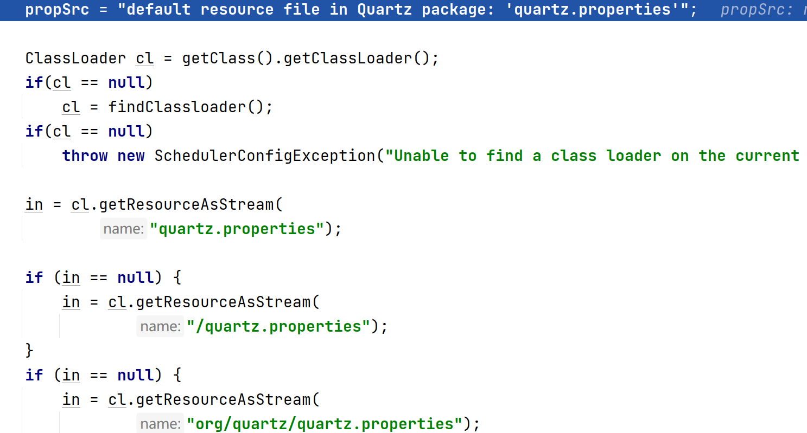

# Quartz配置

Quartz的配置有很多，所以就不一一介绍，这里只介绍常用的几个配置，更详细的内容请查看[官方文档](https://github.com/quartz-scheduler/quartz/blob/master/docs/configuration.adoc#main-configuration-configuration-of-primary-scheduler-settings-transactions)或者[W3Cschool的翻译](https://www.w3cschool.cn/quartz_doc/quartz_doc-ml8e2d9m.html)

### 配置线程池

|属性|属性介绍|是否必填|类型|默认值|
|-|-|-|-|-|
|org.quartz.threadPool.class|使用的线程池的全类名|是|string|null|
|org.quartz.threadPool.threadCount|线程池的线程数|是|int|-1|
|org.quartz.threadPool.threadPriority|线程的优先级|否|int|Thread.NORM_PRIORITY (5)|

* org.quartz.threadPool.class 

使用的线程池的全类名，Quartz默认提供和使用的是 `org.quartz.simpl.SimpleThreadPool` ，如果想要自定义线程池，你需要实现 `org.quartz.spi.ThreadPool` 接口。有关线程池更详细的描述请查看[tutorials-lesson10](tutorials-lesson10.md#线程池)

* org.quartz.threadPool.threadCount

线程池中线程的数量，数量的多少会影响调度的行为。有关线程池更详细的描述请查看[tutorials-lesson10](tutorials-lesson10.md#线程池)

### 配置JobStore

|属性|属性介绍|
|-|-|
|org.quartz.jobStore.class|使用的JobStore的全类名|
|org.quartz.jobStore.driverDelegateClass|数据库驱动的代理|
|org.quartz.jobStore.useProperties|数据的序列化方式|
|org.quartz.jobStore.dataSource|JobStore使用的数据源|
|org.quartz.jobStore.tablePrefix|数据库表前缀|

JobStore的配置会影响到持久化方式和提供给 `Scheduler` 的工作数据等。

Quartz默认提供和使用的 `org.quartz.simpl.RAMJobStore` ，这是将数据持久化到内存中的一种方式。

有关JobStore更详细的介绍请查看[tutorials-lesson9](tutorials-lesson9.md)

### 配置数据源

数据源当且仅当JobStore是JDBCJobStore时才需要配置

|属性|属性介绍|
|-|-|
|org.quartz.dataSource.myDS.driver|数据库驱动全类名|
|org.quartz.dataSource.myDS.URL|数据库连接地址|
|org.quartz.dataSource.myDS.user|数据库用户名|
|org.quartz.dataSource.myDS.password|数据库密码|

上面的myDS是在配置JobStore时配置的 `org.quartz.jobStore.dataSource` 属性值

### 配置Scheduler

|属性|属性介绍|默认值|
|-|-|-|
|org.quartz.scheduler.instanceName|Scheduler的实例名|QuartzScheduler|
|org.quartz.scheduler.instanceId|Scheduler的实例id|NON_CLUSTERED|

* org.quartz.scheduler.instanceName

在没有使用集群功能时，这个属性的值对Scheduler来说没有任何意义，只是用于区分同一程序中的多个Scheduler实例。但如果使用了集群功能，需要为集群中的所有Scheduler实例设置相同的实例名。

* org.quartz.scheduler.instanceId
  
需要在集群中唯一，可以设置为 `AUTO` 自动生成，也可设置为 `SYS_PROP` 从系统属性中读取 `org.quartz.scheduler.instanceId` 的值。

更多有关于Scheduler的配置请查看[tutorials-lesson11](tutorials-lesson11.md#quartz高级功能——集群)中对集群的有关介绍

### 配置集群

|属性|属性介绍|
|-|-|
|org.quartz.jobStore.isClustered|是否是集群|

更多有关于集群的介绍请查看[tutorials-lesson11](tutorials-lesson11.md#quartz高级功能——集群)

### Quartz提供的quartz.properties文件

Quartz的配置文件不是必须的，这是因为Quartz默认提供了一个quartz.properties文件：

```properties
# Default Properties file for use by StdSchedulerFactory
# to create a Quartz Scheduler Instance, if a different
# properties file is not explicitly specified.
#

org.quartz.scheduler.instanceName: DefaultQuartzScheduler
org.quartz.scheduler.rmi.export: false
org.quartz.scheduler.rmi.proxy: false
org.quartz.scheduler.wrapJobExecutionInUserTransaction: false

org.quartz.threadPool.class: org.quartz.simpl.SimpleThreadPool
org.quartz.threadPool.threadCount: 10
org.quartz.threadPool.threadPriority: 5
org.quartz.threadPool.threadsInheritContextClassLoaderOfInitializingThread: true

org.quartz.jobStore.misfireThreshold: 60000

org.quartz.jobStore.class: org.quartz.simpl.RAMJobStore
```

当使用者未指定配置文件时，Quartz会去解析默认的配置文件：



这段代码可以在 `StdSchedulerFactory` 中的 `initialize()` 方法中查看。

