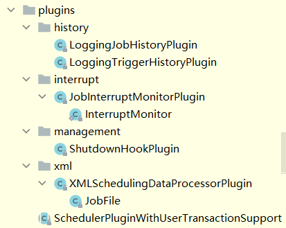
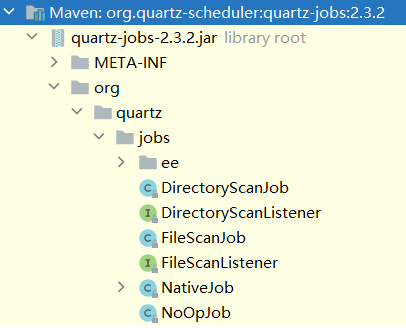

# tutorials-lesson12

quartz的其它功能有：

* 插件

如果想要自定义插件，可以实现 `org.quartz.spi.SchedulerPlugin` 接口。

当然在 `org.quartz.plugins` 包下也有quartz自定义的插件：



* `JobFactory` 

当任务被触发时，是通过配置在 `Scheduler` 上的 `JobFactory` 实例化 `Job` 的。默认的 `JobFactory` 只是通过反射的 `newInstance()` 方法创建，如果想要实现依赖注入和控制反转功能，你可以通过实现 `JobFactory` 接口自定义 `JobFactory`

`Scheduler` 有一个 `setJobFactory` 方法用来设置 `JobFactory`

* quartz提供的 `Job`

quartz也提供了一系列实用的 `Job` ，这些 `Job` 可以在 `org.quartz.jobs` 包中找到，但是这需要额外导入一个maven依赖：

```
<dependency>
    <groupId>org.quartz-scheduler</groupId>
    <artifactId>quartz-jobs</artifactId>
    <version>${quartz-version}</version>
</dependency>
```

