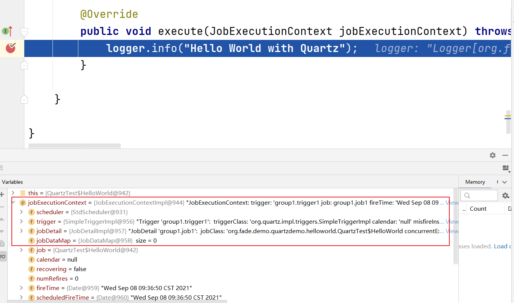
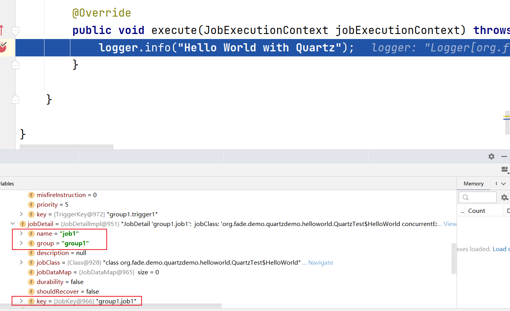

# tutorials-lesson2

Quartz Api 的关键接口：

* `Scheduler` —— 与调度器交互的主要Api
* `Job` —— 你想要调度器执行的任务组件需要实现的接口
* `JobDetail` —— 用于定义作业的实例
* `Trigger` —— 定义执行给定作业的计划的组件
* `JobBuilder` —— 用于创建 `JobDetail` 的实例
* `TriggerBuilder` —— 用于创建 `Trigger` 的实例

其中 `Job` 和 `JobDetail` 可以看作是操作系统中进程和进程实体的关系

`Scheduler` 的生命周期从它被工厂创建出来开始，到调用 `shutdown()` 方法结束。但是只有当调用 `start()` 方法时，它才会触发 `Trigger` 去执行 `Job`

当 `Job` 的一个 `Trigger` 被触发后， `execute()` 方法会被 `Scheduler` 的一个工作线程调用；然后传递给 `execute()` 方法的 `JobExecutionContext` 对象中保存着该 `Job` 运行时的所需的一些信息，如执行 `Job` 的 `Scheduler` 的引用，触发 `Job` 的 `Trigger` 的引用， `JobDetail` 对象引用，以及一些其它信息。

`JobDetail` 包含 `Job` 的各种属性设置，以及用于存储 `Job` 实例状态信息的 `JobDataMap` 。

`Trigger` 用于触发 `Job` 的执行。当你准备调度一个 `Job` 时，你创建一个 `Trigger` 的实例，然后设置调度相关的属性。 `Trigger` 也有一个相关联的 `JobDataMap` ，用于给 `Job` 传递一些触发相关的参数。 Quartz 自带了各种不同类型的 `Trigger` ，最常用的主要是 `SimpleTrigger` 和 `CronTrigger`。

`SimpleTrigger` 主要用于一次性执行的 `Job`（只在某个特定的时间点执行一次），或者 `Job` 在特定的时间点执行，重复执行 N 次，每次执行间隔T个时间单位。 `CronTrigger` 在基于日历的调度上非常有用，如“每个星期五的正午”，或者“每月的第十天的上午 10:15”等。

将 `Job` 和 `Trigger` 注册到 `Scheduler` 时，可以为它们设置 key，配置其身份属性。 `Job` 和 `Trigger` 的 key（JobKey 和 TriggerKey）可以用于将 `Job` 和 `Trigger` 放到不同的分组（group）里，然后基于分组进行操作。同一个分组下的 `Job` 或 `Trigger` 的名称必须唯一，即一个 `Job` 或 `Trigger` 的 key 由名称（name）和分组（group）组成。

