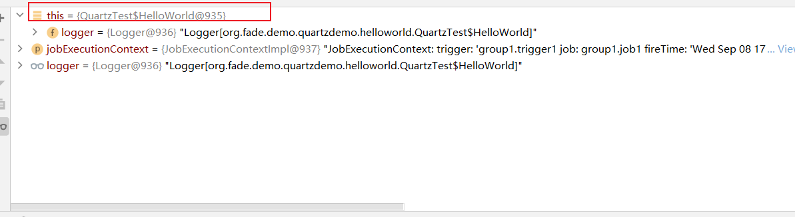
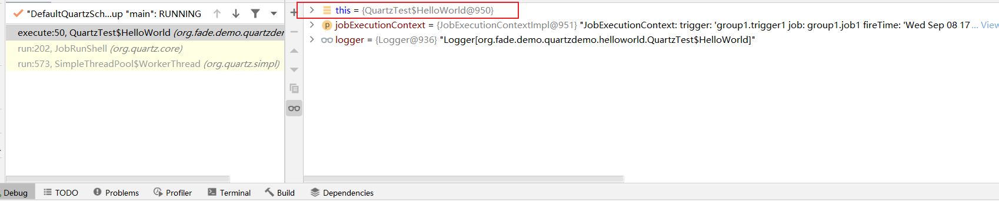
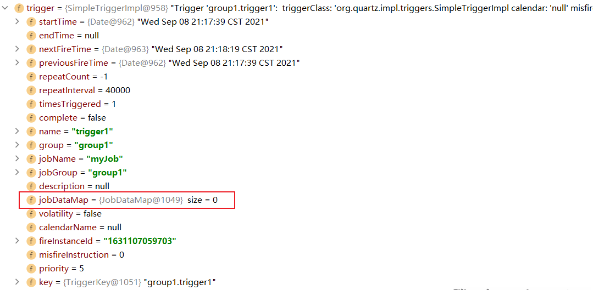

# tutorials-lesson3

`Job` 的实现类只表明这个任务该怎么执行， `JobDetail` 则表明了前面的 `Job` 实例还应具备什么属性

`JobDetail` 通过 `JobBuilder` 创建

`Job` 的生命周期：在调用 `Job` 的 `execute(…)` 方法之前会创建该类的一个新的实例；执行完毕，对该实例的引用就被丢弃了，实例会被垃圾回收，所以在 `Job` 类中定义有状态的数据属性没有意义。

还是前面[HelloWorld](HelloWorld.md)的例子：

当不同时候执行到 `Job` 的 `execute(…)` 方法时：





那么该如何给一个 `Job` 实例提供属性和配置呢？这可以通过 `JobDataMap`

参考下面的例子：

```java
package org.fade.demo.quartzdemo.tutorialslesson3;

import org.quartz.*;
import org.quartz.impl.StdSchedulerFactory;

import static org.quartz.JobBuilder.newJob;
import static org.quartz.SimpleScheduleBuilder.simpleSchedule;

/**
 * @author fade
 * @date 2021/09/08
 */
public class JobDataMapTest {

    public static void main(String[] args) {
        try {
            Scheduler scheduler = StdSchedulerFactory.getDefaultScheduler();
            scheduler.start();
            // do something
            JobDetail job = newJob(DumbJob.class)
                    .withIdentity("myJob", "group1")
                    .usingJobData("jobSays", "Hello World!")
                    .usingJobData("myFloatValue", 3.141f)
                    .build();
            // 每40秒重复执行一次
            Trigger trigger = TriggerBuilder.newTrigger()
                    .withIdentity("trigger1", "group1")
                    .startNow()
                    .withSchedule(simpleSchedule()
                            .withIntervalInSeconds(40)
                            .repeatForever())
                    .build();
            scheduler.scheduleJob(job, trigger);
            try {
                Thread.sleep(60000);
            } catch (InterruptedException e) {
                e.printStackTrace();
            }
            scheduler.shutdown();
        } catch (SchedulerException e) {
            e.printStackTrace();
        }
    }

}
```

```java
package org.fade.demo.quartzdemo.tutorialslesson3;

import org.quartz.*;

/**
 * @author fade
 * @date 2021/09/08
 */
public class DumbJob implements Job {

    public DumbJob() {
    }

    @Override
    public void execute(JobExecutionContext context)
            throws JobExecutionException
    {
        JobKey key = context.getJobDetail().getKey();

        JobDataMap dataMap = context.getJobDetail().getJobDataMap();

        String jobSays = dataMap.getString("jobSays");
        float myFloatValue = dataMap.getFloat("myFloatValue");

        System.err.println("Instance " + key + " of DumbJob says: " + jobSays + ", and val is: " + myFloatValue);
    }

}
```

在上面的例子中，当调用 `Job` 的 `execute()` 方法时，程序会从 `JobDataMap` 中获取实例化 `JobDetail` 时设置的数据，执行的效果如下面所示：

```
20:54:23.424 [DefaultQuartzScheduler_Worker-1] DEBUG org.quartz.core.JobRunShell - Calling execute on job group1.myJob
Instance group1.myJob of DumbJob says: Hello World!, and val is: 3.141
20:54:48.020 [DefaultQuartzScheduler_QuartzSchedulerThread] DEBUG org.quartz.core.QuartzSchedulerThread - batch acquisition of 1 triggers
20:55:03.391 [DefaultQuartzScheduler_QuartzSchedulerThread] DEBUG org.quartz.simpl.PropertySettingJobFactory - Producing instance of Job 'group1.myJob', class=org.fade.demo.quartzdemo.tutorialslesson3.DumbJob
20:55:03.391 [DefaultQuartzScheduler_QuartzSchedulerThread] DEBUG org.quartz.core.QuartzSchedulerThread - batch acquisition of 0 triggers
20:55:03.391 [DefaultQuartzScheduler_Worker-2] DEBUG org.quartz.core.JobRunShell - Calling execute on job group1.myJob
Instance group1.myJob of DumbJob says: Hello World!, and val is: 3.141
```

如果你希望使用 `JobFactory` 实现对 `JobDataMap` 数据的自动注入，可参考下面的例子：

```java
package org.fade.demo.quartzdemo.tutorialslesson3;

import org.quartz.*;

/**
 * @author fade
 * @date 2021/09/08
 */
public class AutowiredJob implements Job {

    private String jobSays;

    private Float myFloatValue;

    public void setJobSays(String jobSays) {
        this.jobSays = jobSays;
    }

    public void setMyFloatValue(Float myFloatValue) {
        this.myFloatValue = myFloatValue;
    }

    @Override
    public void execute(JobExecutionContext context) throws JobExecutionException {
        JobKey key = context.getJobDetail().getKey();
        System.err.println("Instance " + key + " of DumbJob says: " + jobSays + ", and val is: " + myFloatValue);
    }

}
```

上面这段代码可以实现和上面的 `DumbJob` 一样的执行效果

在 `Trigger` 类的实例中也有 `JobDataMap` ：



`JobExecutionContext` 中的 `JobDataMap` 是 `JobDetail` 中的 `JobDataMap` 和 `Trigger` 中的 `JobDataMap` 的并集，但是如果存在相同的数据，则后者会覆盖前者的值。

如果要从 `JobExecutionContext` 中获取 `JobDataMap` ，可参考下面的例子：

```java
package org.fade.demo.quartzdemo.tutorialslesson3;

import org.quartz.*;

/**
 * @author fade
 * @date 2021/09/08
 */
public class GetJobDataMapFromJobExecutionContext implements Job {

    @Override
    public void execute(JobExecutionContext context)
            throws JobExecutionException
    {
        JobKey key = context.getJobDetail().getKey();
        // 注意下面的写法
        JobDataMap dataMap = context.getMergedJobDataMap();

        String jobSays = dataMap.getString("jobSays");
        float myFloatValue = dataMap.getFloat("myFloatValue");

        System.err.println("Instance " + key + " of DumbJob says: " + jobSays + ", and val is: " + myFloatValue);
    }

}
```

下面还有几个与 `Job` 的状态和并发有关的注解：

* `@DisallowConcurrentExecution` 作用在 `Job` 的实现类上，此时Quartz无法执行同一个 `JobDetail` ，但却可以执行 `Job` 实现类的不同实例（ `JobDetail` ）,不同 `JobDetail` ——不同key标识的即为不同的 `JobDetail` ,但是它们却可以根据同一个 `Job` 的实现类来创建

更清楚地说 `@DisallowConcurrentExecution` 的作用是当任务的执行时间大于任务的执行间隔时，改变调度器的默认行为——“为了让任务按照我们预定的时间间隔执行,从而马上启用新的线程执行任务”，让当前线程的任务执行完后再去启用新的线程执行任务

```java
package org.fade.demo.quartzdemo.annotationtest;

import org.quartz.*;
import org.slf4j.Logger;
import org.slf4j.LoggerFactory;

import java.util.Date;

/**
 * @author fade
 * @date 2021/09/13
 */
//@PersistJobDataAfterExecution
//@DisallowConcurrentExecution
public class StatefulDumbJob implements Job {

    private static final Logger logger = LoggerFactory.getLogger(StatefulDumbJob.class);

    public static final String NUM_EXECUTIONS = "NumExecutions";

    public static final String EXECUTION_DELAY = "ExecutionDelay";

    public StatefulDumbJob() {
    }

    @Override
    public void execute(JobExecutionContext context) {
        logger.info("---" + context.getJobDetail().getKey()
                + " executing.[" + new Date() + "]");

        JobDataMap map = context.getJobDetail().getJobDataMap();

        int executeCount = 0;
        if (map.containsKey(NUM_EXECUTIONS)) {
            executeCount = map.getInt(NUM_EXECUTIONS);
        }

        executeCount++;

        map.put(NUM_EXECUTIONS, executeCount);

        long delay = 5000L;
        if (map.containsKey(EXECUTION_DELAY)) {
            delay = map.getLong(EXECUTION_DELAY);
        }

        try {
            Thread.sleep(delay);
        } catch (Exception ignore) {
        }

        logger.info("  -" + context.getJobDetail().getKey()
                + " complete (" + executeCount + ").");

    }

}
```

```java
package org.fade.demo.quartzdemo.annotationtest;

import org.quartz.*;
import org.quartz.impl.StdSchedulerFactory;
import org.slf4j.Logger;
import org.slf4j.LoggerFactory;

import java.util.Date;

import static org.quartz.DateBuilder.nextGivenSecondDate;
import static org.quartz.JobBuilder.newJob;
import static org.quartz.SimpleScheduleBuilder.simpleSchedule;
import static org.quartz.TriggerBuilder.newTrigger;

/**
 * @author fade
 * @date 2021/09/13
 */
public class Main {

    private static final Logger log = LoggerFactory.getLogger(Main.class);

    public static void main(String[] args) throws SchedulerException {
        log.info("------- Initializing -------------------");

        // First we must get a reference to a scheduler
        SchedulerFactory sf = new StdSchedulerFactory();
        Scheduler sched = sf.getScheduler();

        log.info("------- Initialization Complete -----------");

        log.info("------- Scheduling Jobs -----------");

        // jobs can be scheduled before start() has been called

        // get a "nice round" time a few seconds in the future...
        Date startTime = nextGivenSecondDate(null, 15);

        // statefulJob1 will run every three seconds
        // (but it will delay for ten seconds)
        JobDetail job = newJob(StatefulDumbJob.class)
                .withIdentity("statefulJob1", "group1")
                .usingJobData(StatefulDumbJob.EXECUTION_DELAY, 10000L)
                .build();

        SimpleTrigger trigger = newTrigger()
                .withIdentity("trigger1", "group1")
                .startAt(startTime)
                .withSchedule(simpleSchedule()
                        .withIntervalInSeconds(3)
                        .repeatForever())
                .build();

        Date ft = sched.scheduleJob(job, trigger);
        log.info(job.getKey() +
                " will run at: " + ft +
                " and repeat: " + trigger.getRepeatCount() +
                " times, every " + trigger.getRepeatInterval() / 1000 + " seconds");

        log.info("------- Starting Scheduler ----------------");

        // jobs don't start firing until start() has been called...
        sched.start();

        log.info("------- Started Scheduler -----------------");

        try {
            // sleep for ten minutes for triggers to fire....
            Thread.sleep(600L * 1000L);
        } catch (Exception e) {
            e.printStackTrace();
        }

        log.info("------- Shutting Down ---------------------");

        sched.shutdown(true);

        log.info("------- Shutdown Complete -----------------");

        SchedulerMetaData metaData = sched.getMetaData();
        log.info("Executed " + metaData.getNumberOfJobsExecuted() + " jobs.");
    }

}
```

上面的例子中当未启用 `@DisallowConcurrentExecution` 注解时，日志记录如下：

```
15:36:30.013 [DefaultQuartzScheduler_Worker-1] DEBUG org.quartz.core.JobRunShell - Calling execute on job group1.statefulJob1
15:36:30.013 [DefaultQuartzScheduler_Worker-1] INFO org.fade.demo.quartzdemo.annotationtest.StatefulDumbJob - ---group1.statefulJob1 executing.[Mon Sep 13 15:36:30 CST 2021]
15:36:33.005 [DefaultQuartzScheduler_QuartzSchedulerThread] DEBUG org.quartz.simpl.PropertySettingJobFactory - Producing instance of Job 'group1.statefulJob1', class=org.fade.demo.quartzdemo.annotationtest.StatefulDumbJob
15:36:33.005 [DefaultQuartzScheduler_Worker-2] DEBUG org.quartz.core.JobRunShell - Calling execute on job group1.statefulJob1
15:36:33.005 [DefaultQuartzScheduler_QuartzSchedulerThread] DEBUG org.quartz.core.QuartzSchedulerThread - batch acquisition of 1 triggers
15:36:33.005 [DefaultQuartzScheduler_Worker-2] INFO org.fade.demo.quartzdemo.annotationtest.StatefulDumbJob - ---group1.statefulJob1 executing.[Mon Sep 13 15:36:33 CST 2021]
15:36:36.015 [DefaultQuartzScheduler_QuartzSchedulerThread] DEBUG org.quartz.simpl.PropertySettingJobFactory - Producing instance of Job 'group1.statefulJob1', class=org.fade.demo.quartzdemo.annotationtest.StatefulDumbJob
15:36:36.015 [DefaultQuartzScheduler_QuartzSchedulerThread] DEBUG org.quartz.core.QuartzSchedulerThread - batch acquisition of 1 triggers
15:36:36.015 [DefaultQuartzScheduler_Worker-3] DEBUG org.quartz.core.JobRunShell - Calling execute on job group1.statefulJob1
15:36:36.015 [DefaultQuartzScheduler_Worker-3] INFO org.fade.demo.quartzdemo.annotationtest.StatefulDumbJob - ---group1.statefulJob1 executing.[Mon Sep 13 15:36:36 CST 2021]
15:36:39.002 [DefaultQuartzScheduler_QuartzSchedulerThread] DEBUG org.quartz.simpl.PropertySettingJobFactory - Producing instance of Job 'group1.statefulJob1', class=org.fade.demo.quartzdemo.annotationtest.StatefulDumbJob
15:36:39.003 [DefaultQuartzScheduler_QuartzSchedulerThread] DEBUG org.quartz.core.QuartzSchedulerThread - batch acquisition of 1 triggers
15:36:39.003 [DefaultQuartzScheduler_Worker-4] DEBUG org.quartz.core.JobRunShell - Calling execute on job group1.statefulJob1
15:36:39.003 [DefaultQuartzScheduler_Worker-4] INFO org.fade.demo.quartzdemo.annotationtest.StatefulDumbJob - ---group1.statefulJob1 executing.[Mon Sep 13 15:36:39 CST 2021]
15:36:40.014 [DefaultQuartzScheduler_Worker-1] INFO org.fade.demo.quartzdemo.annotationtest.StatefulDumbJob -   -group1.statefulJob1 complete (1).
15:36:42.004 [DefaultQuartzScheduler_QuartzSchedulerThread] DEBUG org.quartz.simpl.PropertySettingJobFactory - Producing instance of Job 'group1.statefulJob1', class=org.fade.demo.quartzdemo.annotationtest.StatefulDumbJob
15:36:42.005 [DefaultQuartzScheduler_QuartzSchedulerThread] DEBUG org.quartz.core.QuartzSchedulerThread - batch acquisition of 1 triggers
15:36:42.005 [DefaultQuartzScheduler_Worker-5] DEBUG org.quartz.core.JobRunShell - Calling execute on job group1.statefulJob1
15:36:42.005 [DefaultQuartzScheduler_Worker-5] INFO org.fade.demo.quartzdemo.annotationtest.StatefulDumbJob - ---group1.statefulJob1 executing.[Mon Sep 13 15:36:42 CST 2021]
15:36:43.007 [DefaultQuartzScheduler_Worker-2] INFO org.fade.demo.quartzdemo.annotationtest.StatefulDumbJob -   -group1.statefulJob1 complete (1).
```

可以看到 `DefaultQuartzScheduler_Worker-1` 的执行完成的日志输出是在 `DefaultQuartzScheduler_Worker-4` 的开始执行的日志输出之后的。这也证明了在不启用 `@DisallowConcurrentExecution` 注解的时候，调度器是默认在任务的执行间隔后启用新线程执行任务的

上面的例子中当启用 `@DisallowConcurrentExecution` 注解时，日志记录如下：

```
15:41:00.017 [DefaultQuartzScheduler_Worker-1] DEBUG org.quartz.core.JobRunShell - Calling execute on job group1.statefulJob1
15:41:00.017 [DefaultQuartzScheduler_Worker-1] INFO org.fade.demo.quartzdemo.annotationtest.StatefulDumbJob - ---group1.statefulJob1 executing.[Mon Sep 13 15:41:00 CST 2021]
15:41:10.018 [DefaultQuartzScheduler_Worker-1] INFO org.fade.demo.quartzdemo.annotationtest.StatefulDumbJob -   -group1.statefulJob1 complete (1).
15:41:10.020 [DefaultQuartzScheduler_QuartzSchedulerThread] DEBUG org.quartz.core.QuartzSchedulerThread - batch acquisition of 1 triggers
15:41:10.020 [DefaultQuartzScheduler_QuartzSchedulerThread] DEBUG org.quartz.simpl.PropertySettingJobFactory - Producing instance of Job 'group1.statefulJob1', class=org.fade.demo.quartzdemo.annotationtest.StatefulDumbJob
15:41:10.020 [DefaultQuartzScheduler_QuartzSchedulerThread] DEBUG org.quartz.core.QuartzSchedulerThread - batch acquisition of 0 triggers
15:41:10.020 [DefaultQuartzScheduler_Worker-2] DEBUG org.quartz.core.JobRunShell - Calling execute on job group1.statefulJob1
15:41:10.020 [DefaultQuartzScheduler_Worker-2] INFO org.fade.demo.quartzdemo.annotationtest.StatefulDumbJob - ---group1.statefulJob1 executing.[Mon Sep 13 15:41:10 CST 2021]
15:41:20.028 [DefaultQuartzScheduler_Worker-2] INFO org.fade.demo.quartzdemo.annotationtest.StatefulDumbJob -   -group1.statefulJob1 complete (1).
15:41:20.029 [DefaultQuartzScheduler_QuartzSchedulerThread] DEBUG org.quartz.core.QuartzSchedulerThread - batch acquisition of 1 triggers
15:41:20.030 [DefaultQuartzScheduler_QuartzSchedulerThread] DEBUG org.quartz.simpl.PropertySettingJobFactory - Producing instance of Job 'group1.statefulJob1', class=org.fade.demo.quartzdemo.annotationtest.StatefulDumbJob
15:41:20.030 [DefaultQuartzScheduler_QuartzSchedulerThread] DEBUG org.quartz.core.QuartzSchedulerThread - batch acquisition of 0 triggers
15:41:20.030 [DefaultQuartzScheduler_Worker-3] DEBUG org.quartz.core.JobRunShell - Calling execute on job group1.statefulJob1
15:41:20.030 [DefaultQuartzScheduler_Worker-3] INFO org.fade.demo.quartzdemo.annotationtest.StatefulDumbJob - ---group1.statefulJob1 executing.[Mon Sep 13 15:41:20 CST 2021]
15:41:30.036 [DefaultQuartzScheduler_Worker-3] INFO org.fade.demo.quartzdemo.annotationtest.StatefulDumbJob -   -group1.statefulJob1 complete (1).
15:41:30.036 [DefaultQuartzScheduler_QuartzSchedulerThread] DEBUG org.quartz.core.QuartzSchedulerThread - batch acquisition of 1 triggers
15:41:30.037 [DefaultQuartzScheduler_QuartzSchedulerThread] DEBUG org.quartz.simpl.PropertySettingJobFactory - Producing instance of Job 'group1.statefulJob1', class=org.fade.demo.quartzdemo.annotationtest.StatefulDumbJob
15:41:30.037 [DefaultQuartzScheduler_QuartzSchedulerThread] DEBUG org.quartz.core.QuartzSchedulerThread - batch acquisition of 0 triggers
15:41:30.037 [DefaultQuartzScheduler_Worker-4] DEBUG org.quartz.core.JobRunShell - Calling execute on job group1.statefulJob1
15:41:30.037 [DefaultQuartzScheduler_Worker-4] INFO org.fade.demo.quartzdemo.annotationtest.StatefulDumbJob - ---group1.statefulJob1 executing.[Mon Sep 13 15:41:30 CST 2021]
15:41:40.040 [DefaultQuartzScheduler_Worker-4] INFO org.fade.demo.quartzdemo.annotationtest.StatefulDumbJob -   -group1.statefulJob1 complete (1).
15:41:40.040 [DefaultQuartzScheduler_QuartzSchedulerThread] DEBUG org.quartz.core.QuartzSchedulerThread - batch acquisition of 1 triggers
15:41:40.041 [DefaultQuartzScheduler_QuartzSchedulerThread] DEBUG org.quartz.simpl.PropertySettingJobFactory - Producing instance of Job 'group1.statefulJob1', class=org.fade.demo.quartzdemo.annotationtest.StatefulDumbJob
15:41:40.041 [DefaultQuartzScheduler_QuartzSchedulerThread] DEBUG org.quartz.core.QuartzSchedulerThread - batch acquisition of 0 triggers
15:41:40.041 [DefaultQuartzScheduler_Worker-5] DEBUG org.quartz.core.JobRunShell - Calling execute on job group1.statefulJob1
15:41:40.041 [DefaultQuartzScheduler_Worker-5] INFO org.fade.demo.quartzdemo.annotationtest.StatefulDumbJob - ---group1.statefulJob1 executing.[Mon Sep 13 15:41:40 CST 2021]
```

这回可以看到调度器是在一个线程执行完任务后再启用下一个线程执行任务的

* `@PersistJobDataAfterExecution` 作用在 `Job` 的实现类上，告诉Quartz在成功执行了 `Job` 类的 `execute()` 方法后（没有发生任何异常），更新 `JobDetail` 中 `JobDataMap` 的数据，使得在下一次执行的时候， `JobDataMap` 中是更新后的数据，而不是更新前的旧数据。

如果你使用了 `@PersistJobDataAfterExecution` 注解，为了防止出现并发问题，最好同时使用 `@DisallowConcurrentExecution `

注意 `@PersistJobDataAfterExecution` 更新的是 `JobDetail` 中 `JobDataMap` 的数据，但是如果更新 `JobExecutionContext` 里的 `JobDataMap` ，这是不会有任何影响的。

通过 `JobDetail` 对象，可以给 `Job` 实例配置的其它属性有：

* `durability` 如果一个job是非持久的，当没有活跃的trigger与之关联的时候，会被自动地从scheduler中删除。也就是说，非持久的job的生命期是由trigger的存在与否决定的
* `requestsRecovery()` 如果一个job是可恢复的，并且在其执行的时候，scheduler发生硬关闭（hard shutdown)（比如运行的进程崩溃了，或者关机了），则当scheduler重新启动的时候，该job会被重新执行。此时， `JobExecutionContext.isRecovering()` 返回true。 

`Job` 类的 `execute()` 方法只允许抛出 `JobExecutionException` 和 `RuntimeExceptions`

`Job` 在被执行时可以被 `Scheduler` 打断，通过 `sched.interrupt(job.getKey())` 方法实现，但是此时自定义 `Job` 类必须实现 `InterruptableJob` 接口，不然会产生异常。下面是一个使用示例：

```java
package org.quartz.examples.example7;

import java.util.Date;

import org.quartz.*;
import org.slf4j.Logger;
import org.slf4j.LoggerFactory;

//public class DumbInterruptableJob implements Job {
public class DumbInterruptableJob implements InterruptableJob {
    
    // logging services
    private static final Logger logger = LoggerFactory.getLogger(DumbInterruptableJob.class);
    
    // has the job been interrupted?
    private boolean interrupted = false;

    // job name 
    private JobKey jobKey = null;
    
    public DumbInterruptableJob() {
    }

    @Override
    public void execute(JobExecutionContext context)
        throws JobExecutionException {

        jobKey = context.getJobDetail().getKey();
        logger.info("---- " + jobKey + " executing at " + new Date());

        try {
            // main job loop... see the JavaDOC for InterruptableJob for discussion...
            // do some work... in this example we are 'simulating' work by sleeping... :)

            for (int i = 0; i < 4; i++) {
                try {
                    Thread.sleep(1000L);
                } catch (Exception ignore) {
                    ignore.printStackTrace();
                }
                
                // periodically check if we've been interrupted...
                if(interrupted) {
                    logger.info("--- " + jobKey + "  -- Interrupted... bailing out!");
                    return; // could also choose to throw a JobExecutionException 
                             // if that made for sense based on the particular  
                             // job's responsibilities/behaviors
                }
            }
            
        } finally {
            logger.info("---- " + jobKey + " completed at " + new Date());
        }
    }
    
    @Override
    public void interrupt() throws UnableToInterruptJobException {
        logger.info("---" + jobKey + "  -- INTERRUPTING --");
        interrupted = true;
    }

}
 
package org.quartz.examples.example7;

import static org.quartz.DateBuilder.nextGivenSecondDate;
import static org.quartz.JobBuilder.newJob;
import static org.quartz.SimpleScheduleBuilder.simpleSchedule;
import static org.quartz.TriggerBuilder.newTrigger;

import org.quartz.JobDetail;
import org.quartz.Scheduler;
import org.quartz.SchedulerFactory;
import org.quartz.SchedulerMetaData;
import org.quartz.SimpleTrigger;
import org.quartz.impl.StdSchedulerFactory;
import org.slf4j.Logger;
import org.slf4j.LoggerFactory;

import java.util.Date;

public class InterruptExample {

  public void run() throws Exception {
    final Logger log = LoggerFactory.getLogger(InterruptExample.class);

    log.info("------- Initializing ----------------------");

    // First we must get a reference to a scheduler
    SchedulerFactory sf = new StdSchedulerFactory();
    Scheduler sched = sf.getScheduler();

    log.info("------- Initialization Complete -----------");

    log.info("------- Scheduling Jobs -------------------");

    // get a "nice round" time a few seconds in the future...
    Date startTime = nextGivenSecondDate(null, 15);

    JobDetail job = newJob(DumbInterruptableJob.class).withIdentity("interruptableJob1", "group1").build();

    SimpleTrigger trigger = newTrigger().withIdentity("trigger1", "group1").startAt(startTime)
        .withSchedule(simpleSchedule().withIntervalInSeconds(5).repeatForever()).build();

    Date ft = sched.scheduleJob(job, trigger);
    log.info(job.getKey() + " will run at: " + ft + " and repeat: " + trigger.getRepeatCount() + " times, every "
             + trigger.getRepeatInterval() / 1000 + " seconds");

    // start up the scheduler (jobs do not start to fire until
    // the scheduler has been started)
    sched.start();
    log.info("------- Started Scheduler -----------------");

    log.info("------- Starting loop to interrupt job every 7 seconds ----------");
    for (int i = 0; i < 50; i++) {
      try {
        Thread.sleep(7000L);
        // tell the scheduler to interrupt our job
        sched.interrupt(job.getKey());
      } catch (Exception e) {
        //
      }
    }

    log.info("------- Shutting Down ---------------------");

    sched.shutdown(true);

    log.info("------- Shutdown Complete -----------------");
    SchedulerMetaData metaData = sched.getMetaData();
    log.info("Executed " + metaData.getNumberOfJobsExecuted() + " jobs.");

  }

  public static void main(String[] args) throws Exception {

    InterruptExample example = new InterruptExample();
    example.run();
  }

}
```