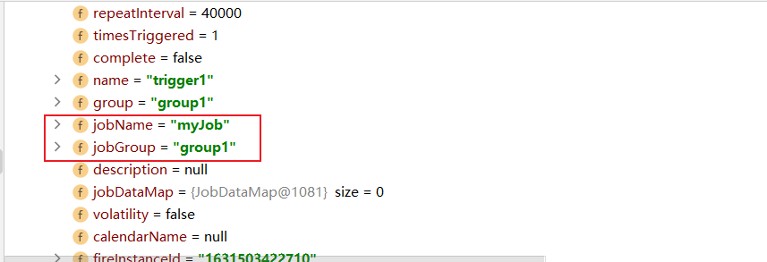
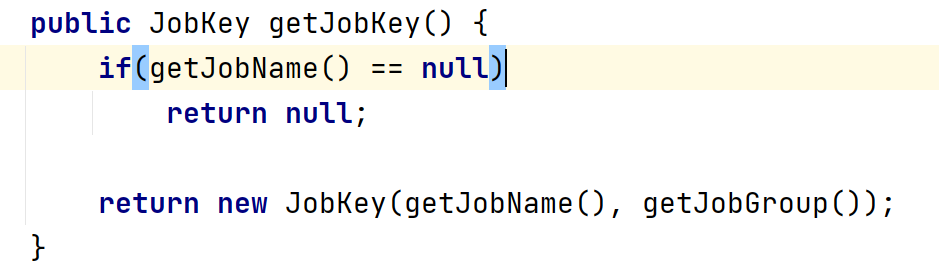
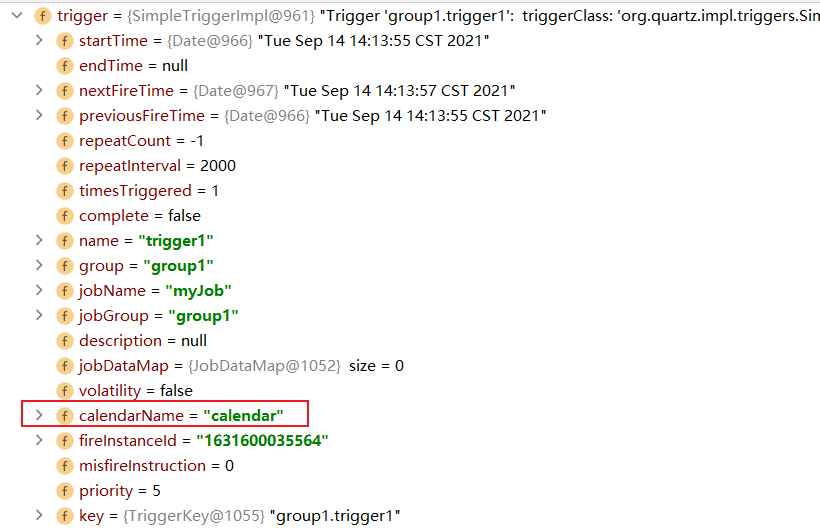

# tutorials-lesson4

`Trigger` 的共有属性：

* `jobKey` 触发 `Trigger` 的 `JobDetail` 的身份，但其实可能实现类并未直接保存 `jobKey` ，而是保存的 `jobName` 和 `jobGroup` ，但其提供了一个 `getJobKey()` 方法获取 `jobKey`





* `startTime` `Trigger` 的第一次生效时间，类型是 `java.util.Date` ，`startTime` 和 `Trigger` 的触发时间不总是一致的，例如：现在是1月份，你设置了一个 `Trigger` –“在每个月的第5天执行”，然后你将 `startTime` 属性设置为4月1号，则该 `Trigger` 第一次触发会是在几个月以后了(即4月5号)
* `endTime` `Trigger` 的失效时间
* `key` - `TriggerKey` ， `Trigger` 的身份标识
* `priority` `Trigger` 的优先级，当 `Trigger` 较多而线程资源又不足时，优先级最高的 `Trigger` 将被执行，默认是5，优先级可以为正或为负。 `Trigger` 的优先级总是在相同触发时间的 `Trigger` 之间进行比较。 如果 `Trigger` 是可恢复的，在恢复后再调度时，优先级与原 `Trigger` 是一样的
* `misfireInstruction` 一个持久性的 `Trigger` 有可能因为某些原因（线程资源不足，调度的 `Scheduler` 挂了）而错失了触发时间。不同的 `Trigger` 有不同的可用的 `misfireInstruction` ，默认使用 `MISFIRE_INSTRUCTION_SMART_POLICY` —— 根据 `Trigger` 的类型和配置调整调整行为。当 `Scheduler` 启动时会去寻找错失了触发时间的持久性 `Trigger` ，并根据它们各自的 `misfireInstruction` 去更新 `Trigger` 。
* `calendarName` quartz的 `Calendar` 对象(不是 `java.util.Calendar` 对象)可以在定义和存储 `Trigger` 的时候与 `Trigger` 进行关联。`Calendar` 在从调度计划中排除时间的方面作用很大。 `Calendar` 必须先实力换然后通过 `Scheduler` 的 `addCalendar(..)` 方法注册。
  
下面是一个使用 `Calendar` 的例子：

```java
package org.fade.demo.quartzdemo.tutorialslesson4;

import org.quartz.*;
import org.quartz.impl.StdSchedulerFactory;
import org.quartz.impl.calendar.HolidayCalendar;

import java.util.Date;

import static org.quartz.JobBuilder.newJob;
import static org.quartz.SimpleScheduleBuilder.simpleSchedule;

/**
 * @author fade
 * @date 2021/09/14
 */
public class Main {

    public static void main(String[] args) {
        try {
            Scheduler scheduler = scheduler = StdSchedulerFactory.getDefaultScheduler();
            scheduler.start();
            // do something
            JobDetail job = newJob(DumbJob.class)
                    .withIdentity("myJob", "group1")
                    .usingJobData("jobSays", "Hello World!")
                    .usingJobData("myFloatValue", 3.141f)
                    .build();
            HolidayCalendar calendar = new HolidayCalendar();
            calendar.addExcludedDate(new Date());
            scheduler.addCalendar("calendar", calendar, true, true);
            // 每40秒重复执行一次
            Trigger trigger = TriggerBuilder.newTrigger()
                    .withIdentity("trigger1", "group1")
                    .startNow()
                    .withSchedule(simpleSchedule()
                            .withIntervalInSeconds(2)
                            .repeatForever())
                    .modifiedByCalendar("calendar")
                    .build();
            scheduler.scheduleJob(job, trigger);
            try {
                Thread.sleep(60000);
            } catch (InterruptedException e) {
                e.printStackTrace();
            }
            scheduler.shutdown();
        } catch (SchedulerException e) {
            e.printStackTrace();
        }


    }

}

package org.fade.demo.quartzdemo.tutorialslesson4;

import org.quartz.*;

/**
 * @author fade
 * @date 2021/09/08
 */
public class DumbJob implements Job {

    public DumbJob() {
    }

    @Override
    public void execute(JobExecutionContext context)
            throws JobExecutionException
    {
        JobKey key = context.getJobDetail().getKey();

        JobDataMap dataMap = context.getJobDetail().getJobDataMap();

        String jobSays = dataMap.getString("jobSays");
        float myFloatValue = dataMap.getFloat("myFloatValue");

        System.err.println(Thread.currentThread().getName() + "-------" + "Instance " + key + " of DumbJob says: " + jobSays + ", and val is: " + myFloatValue);
    }

}
```

在上面的例子中，程序不会执行任务中的打印语句就退出了，这是因为设置了 `Calendar` 并从调度计划中排除了今天。

如果只是把 `Calendar` 实例化后不排除日期就注册进 `Scheduler` 中，你又能看到程序在执行任务中的打印语句了。此时 `Trigger` 中的 `calendarName` 属性是我们在 `main` 方法里配置的 `Calendar` 的 `calendar` ：

