# tutorials-lesson5

`SimpleTrigger` 可以满足的调度需求是：在具体的时间点执行一次，或者在具体的时间点执行，并且以指定的间隔重复执行若干次。

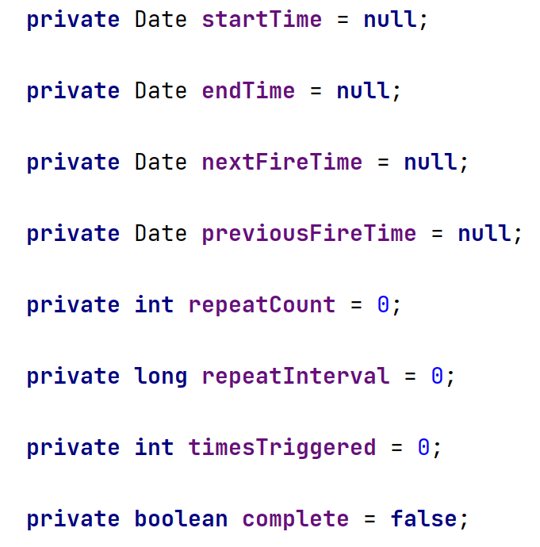

`SimpleTrigger` 的属性如上图所示。

`repeatCount` 可以取值为0、整数和 `SimpleTrigger.REPEAT_INDEFINITELY` 。

`repeatInterval` 必须取值为0(官方文档上可以为0，但是实际上貌似不能设置为0)或正的 `long` 类型值，并以毫秒为单位。

`DateBuilder` 对创建 `startTime` 和 `endTime` 来说非常方便


如果设置了 `endTime` 属性，那么它将会覆盖 `repeatCount` 属性。

```java
package org.fade.demo.quartzdemo.tutorialslesson5;

import org.quartz.*;
import org.quartz.impl.StdSchedulerFactory;
import org.slf4j.Logger;
import org.slf4j.LoggerFactory;

import java.util.Date;

import static org.quartz.JobBuilder.newJob;
import static org.quartz.SimpleScheduleBuilder.simpleSchedule;

/**
 * @author fade
 * @date 2021/09/14
 */
public class Main {

    private static final Logger logger = LoggerFactory.getLogger(Main.class);

    public static void main(String[] args) {
        try {
            Scheduler scheduler = scheduler = StdSchedulerFactory.getDefaultScheduler();
            scheduler.start();
            // do something
            JobDetail job = newJob(DumbJob.class)
                    .withIdentity("myJob", "group1")
                    .usingJobData("jobSays", "Hello World!")
                    .usingJobData("myFloatValue", 3.141f)
                    .build();
            // 每40秒重复执行一次
            Date date = new Date();
            logger.info("scheduling will end at few seconds after " + date);
            Trigger trigger = TriggerBuilder.newTrigger()
                    .withIdentity("trigger1", "group1")
                    .startNow()
                    .withSchedule(simpleSchedule()
                                    .withIntervalInSeconds(2)
//                            .withRepeatCount(0)
                                    .repeatForever()
                    )
                    .endAt(DateBuilder.nextGivenSecondDate(date, 10))
                    .build();
            scheduler.scheduleJob(job, trigger);
            try {
                Thread.sleep(60000);
            } catch (InterruptedException e) {
                e.printStackTrace();
            }
            scheduler.shutdown();
        } catch (SchedulerException e) {
            e.printStackTrace();
        }
    }

}

package org.fade.demo.quartzdemo.tutorialslesson5;

import org.quartz.*;

/**
 * @author fade
 * @date 2021/09/08
 */
public class DumbJob implements Job {

    public DumbJob() {
    }

    @Override
    public void execute(JobExecutionContext context)
            throws JobExecutionException
    {
        JobKey key = context.getJobDetail().getKey();

        JobDataMap dataMap = context.getJobDetail().getJobDataMap();

        String jobSays = dataMap.getString("jobSays");
        float myFloatValue = dataMap.getFloat("myFloatValue");

        System.err.println(Thread.currentThread().getName() + "-------" + "Instance " + key + " of DumbJob says: " + jobSays + ", and val is: " + myFloatValue);
    }

}
```

上面的代码中虽然调用了 `repeatForever()` 方法，但后面还调用了 `endAt` 方法，此时任务调度将在指定的结束时间结束。

`SimpleTrigger` 使用 `TriggerBuilder` 设置 `Trigger` 主要的属性，使用 `SimpleScheduleBuilder` 设置与 `SimpleTrigger` 有关的属性。如：

```java
Trigger trigger = TriggerBuilder.newTrigger()
                    .withIdentity("trigger1", "group1")
                    .startNow()
                    .withSchedule(simpleSchedule()
                                    .withIntervalInSeconds(2)
//                            .withRepeatCount(0)
                                    .repeatForever()
                    )
                    .endAt(DateBuilder.nextGivenSecondDate(date, 10))
                    .build();
```

quartz会为你没显式设置的属性设置合理的值。

`SimpleTrigger` 的 `misfireInstruction` 如下所示：

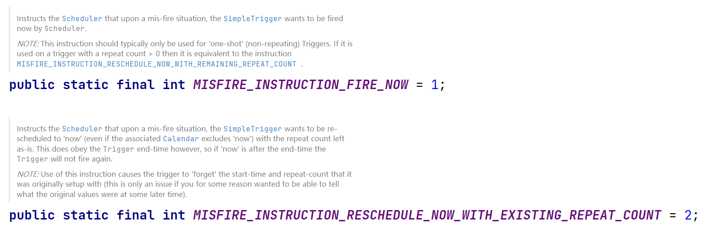

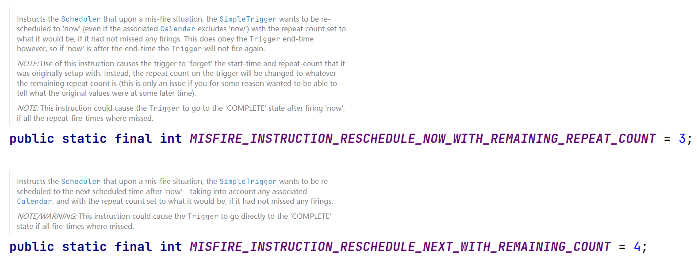

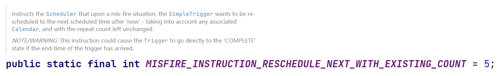

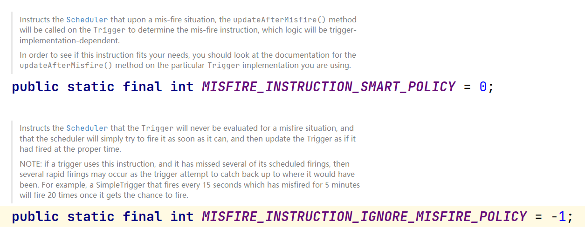

各个 `misfireInstruction` 的含义:（可在 `updateAfterMisfire` 方法和JavaDoc查看相应的含义）

* `MISFIRE_INSTRUCTION_SMART_POLICY`

在 `SimpleTrigger` 中， `MISFIRE_INSTRUCTION_SMART_POLICY` 会根据配置选择 `MISFIRE_INSTRUCTION_FIRE_NOW` 、 `MISFIRE_INSTRUCTION_RESCHEDULE_NEXT_WITH_REMAINING_COUNT` 和 `MISFIRE_INSTRUCTION_RESCHEDULE_NOW_WITH_EXISTING_REPEAT_COUNT` 中的一个，这在 `SimpleTriggerImpl` 的 `updateAfterMisfire` 方法中有所体现：

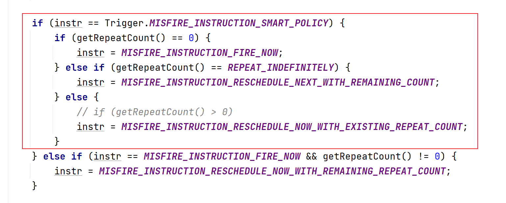

* `MISFIRE_INSTRUCTION_IGNORE_MISFIRE_POLICY`

此种策略会使调度器不评估当时的情况，而是尽快将其触发以赶上正常的进度。例如一个每15秒触发一次的 `SimpleTrigger` ，如果有5分钟的错失时间，一旦有机会触发，就会快速连续触发20次。

* `MISFIRE_INSTRUCTION_FIRE_NOW`

此策略会使调度器马上将 `Trigger` 触发一次

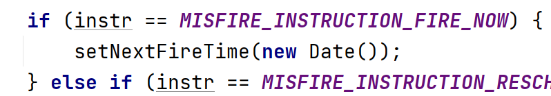

* `MISFIRE_INSTRUCTION_RESCHEDULE_NOW_WITH_EXISTING_REPEAT_COUNT`

此策略会使调度器马上触发 `Trigger` 一次，然后按剩余还需重复多少次(总次数-已触发次数)和配置的时间间隔进行调度

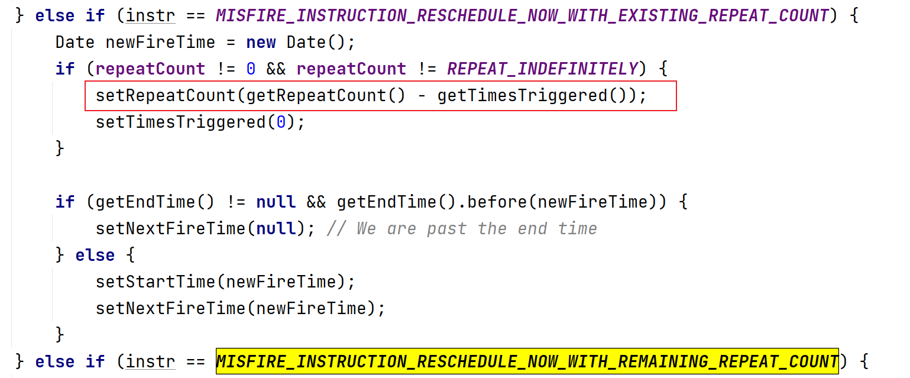

* `MISFIRE_INSTRUCTION_RESCHEDULE_NOW_WITH_REMAINING_REPEAT_COUNT`

此策略会使调度器马上触发 `Trigger` 一次，然后按剩余还需重复多少次(总次数-已触发次数-已错过的次数)和配置的时间间隔进行调度

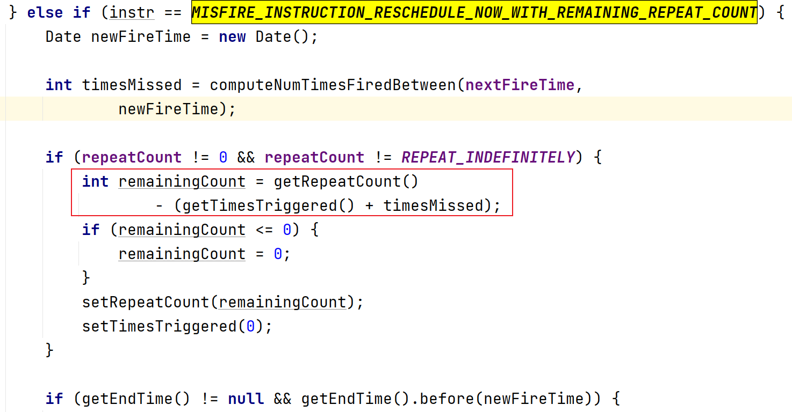

* `MISFIRE_INSTRUCTION_RESCHEDULE_NEXT_WITH_REMAINING_COUNT`

此策略会使调度器在下一个调度时间开始触发 `Trigger` ，然后按剩余还需重复多少次(总次数-已触发次数-已错过的次数)和配置的时间间隔进行调度

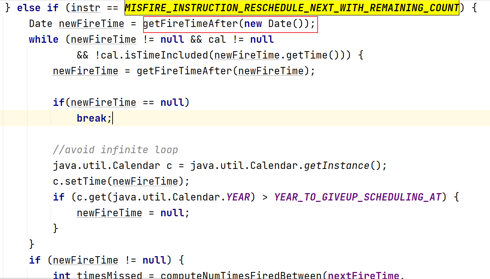

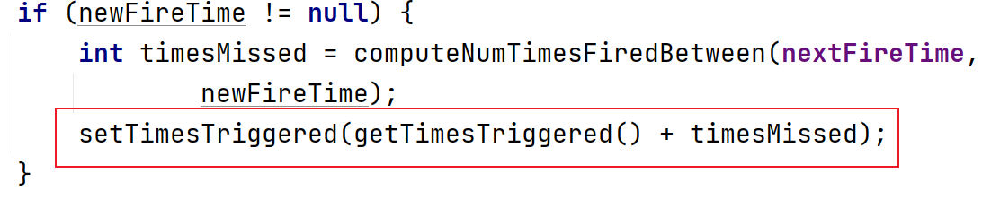

* `MISFIRE_INSTRUCTION_RESCHEDULE_NEXT_WITH_EXISTING_COUNT`

此策略会使调度器在下一个调度时间开始触发 `Trigger` ，然后按剩余还需重复多少次(总次数-已触发次数)和配置的时间间隔进行调度

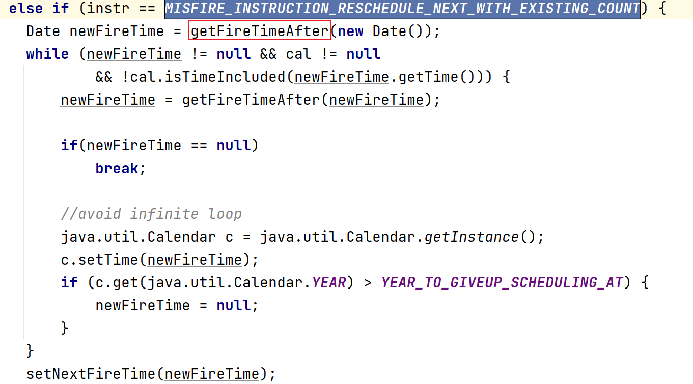

一般我们通过 `SimpleSchedulerBuilder` 的有关方法指定 `Trigger` 对应的 `misfireInstruction` ，如：

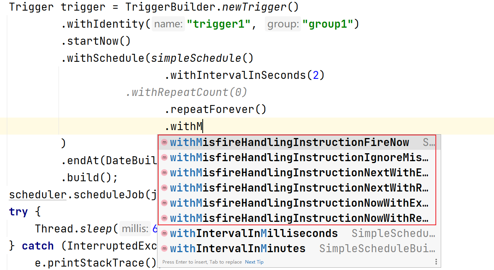


下面是一个使用示例：

```java
package org.quartz.examples.example5;

import static org.quartz.DateBuilder.nextGivenSecondDate;
import static org.quartz.JobBuilder.newJob;
import static org.quartz.SimpleScheduleBuilder.simpleSchedule;
import static org.quartz.TriggerBuilder.newTrigger;

import org.quartz.JobDetail;
import org.quartz.Scheduler;
import org.quartz.SchedulerFactory;
import org.quartz.SchedulerMetaData;
import org.quartz.SimpleTrigger;
import org.quartz.impl.StdSchedulerFactory;
import org.slf4j.Logger;
import org.slf4j.LoggerFactory;

import java.util.Date;

public class MisfireExample {

  public void run() throws Exception {
    Logger log = LoggerFactory.getLogger(MisfireExample.class);

    log.info("------- Initializing -------------------");

    // First we must get a reference to a scheduler
    SchedulerFactory sf = new StdSchedulerFactory();
    Scheduler sched = sf.getScheduler();

    log.info("------- Initialization Complete -----------");

    log.info("------- Scheduling Jobs -----------");

    // jobs can be scheduled before start() has been called

    // get a "nice round" time a few seconds in the future...
    Date startTime = nextGivenSecondDate(null, 15);

    // statefulJob1 will run every three seconds
    // (but it will delay for ten seconds)
    JobDetail job = newJob(StatefulDumbJob.class).withIdentity("statefulJob1", "group1")
        .usingJobData(StatefulDumbJob.EXECUTION_DELAY, 10000L).build();

    SimpleTrigger trigger = newTrigger().withIdentity("trigger1", "group1").startAt(startTime)
        .withSchedule(simpleSchedule().withIntervalInSeconds(3).repeatForever()).build();

    Date ft = sched.scheduleJob(job, trigger);
    log.info(job.getKey() + " will run at: " + ft + " and repeat: " + trigger.getRepeatCount() + " times, every "
             + trigger.getRepeatInterval() / 1000 + " seconds");

    // statefulJob2 will run every three seconds
    // (but it will delay for ten seconds - and therefore purposely misfire after a few iterations)
    job = newJob(StatefulDumbJob.class).withIdentity("statefulJob2", "group1")
        .usingJobData(StatefulDumbJob.EXECUTION_DELAY, 10000L).build();

    trigger = newTrigger()
        .withIdentity("trigger2", "group1")
        .startAt(startTime)
        .withSchedule(simpleSchedule().withIntervalInSeconds(3).repeatForever()
                          .withMisfireHandlingInstructionNowWithExistingCount()) // set misfire instructions
        .build();

    ft = sched.scheduleJob(job, trigger);
    log.info(job.getKey() + " will run at: " + ft + " and repeat: " + trigger.getRepeatCount() + " times, every "
             + trigger.getRepeatInterval() / 1000 + " seconds");

    log.info("------- Starting Scheduler ----------------");

    // jobs don't start firing until start() has been called...
    sched.start();

    log.info("------- Started Scheduler -----------------");

    try {
      // sleep for ten minutes for triggers to file....
      Thread.sleep(600L * 1000L);
    } catch (Exception e) {
      //
    }

    log.info("------- Shutting Down ---------------------");

    sched.shutdown(true);

    log.info("------- Shutdown Complete -----------------");

    SchedulerMetaData metaData = sched.getMetaData();
    log.info("Executed " + metaData.getNumberOfJobsExecuted() + " jobs.");
  }

  public static void main(String[] args) throws Exception {

    MisfireExample example = new MisfireExample();
    example.run();
  }

}
 
package org.quartz.examples.example5;

import org.quartz.DisallowConcurrentExecution;
import org.quartz.Job;
import org.quartz.JobDataMap;
import org.quartz.JobExecutionContext;
import org.quartz.JobExecutionException;
import org.quartz.PersistJobDataAfterExecution;

import java.util.Date;

@PersistJobDataAfterExecution
@DisallowConcurrentExecution
public class StatefulDumbJob implements Job {

  public static final String NUM_EXECUTIONS  = "NumExecutions";

  public static final String EXECUTION_DELAY = "ExecutionDelay";

  public StatefulDumbJob() {
  }

  @Override
  public void execute(JobExecutionContext context) throws JobExecutionException {
    System.err.println("---" + context.getJobDetail().getKey() + " executing.[" + new Date() + "]");

    JobDataMap map = context.getJobDetail().getJobDataMap();

    int executeCount = 0;
    if (map.containsKey(NUM_EXECUTIONS)) {
      executeCount = map.getInt(NUM_EXECUTIONS);
    }

    executeCount++;

    map.put(NUM_EXECUTIONS, executeCount);

    long delay = 5000L;
    if (map.containsKey(EXECUTION_DELAY)) {
      delay = map.getLong(EXECUTION_DELAY);
    }

    try {
      Thread.sleep(delay);
    } catch (Exception ignore) {
      //
    }

    System.err.println("  -" + context.getJobDetail().getKey() + " complete (" + executeCount + ").");

  }

}
```

上面的示例中，group1.trigger1这个 `Trigger` 的 `misfireInstruction` 是 `MISFIRE_INSTRUCTION_SMART_POLICY` ，而 group1.trigger2这个 `Trigger` 是 `MISFIRE_INSTRUCTION_RESCHEDULE_NOW_WITH_EXISTING_REPEAT_COUNT` ，所以它们错失触发时间后的行为也是不同的。