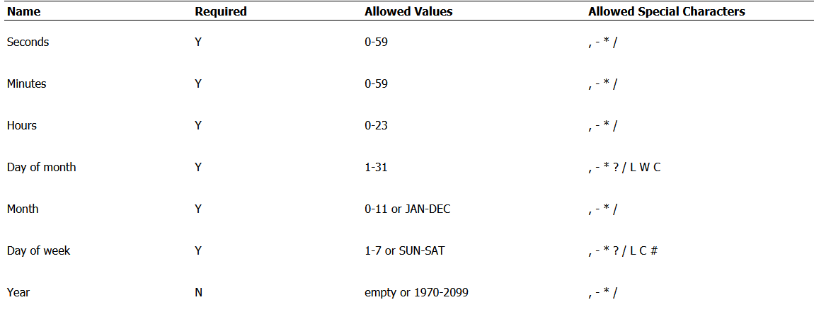
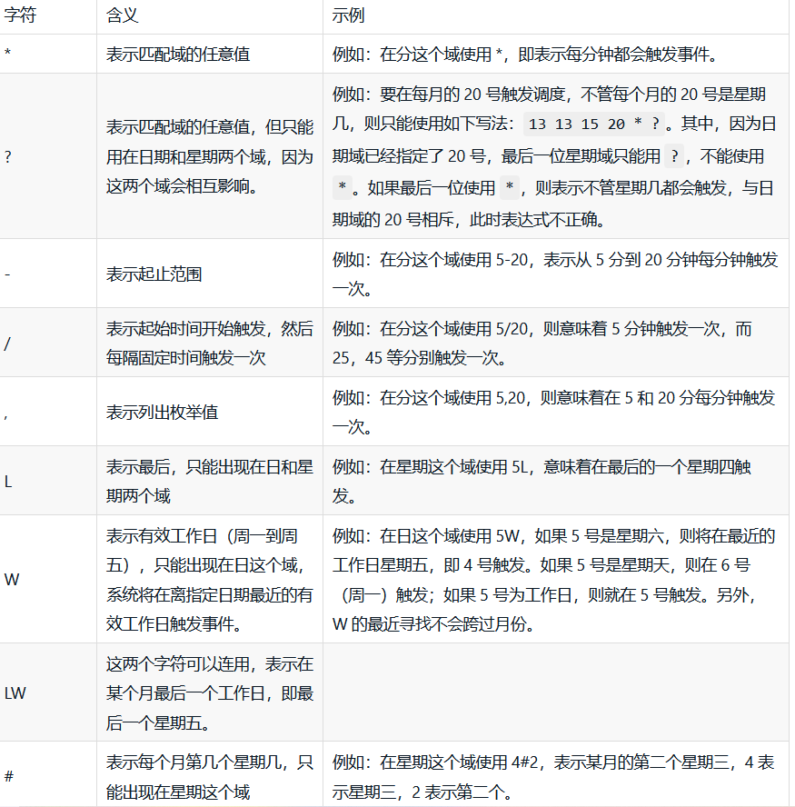
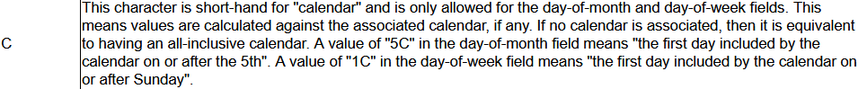
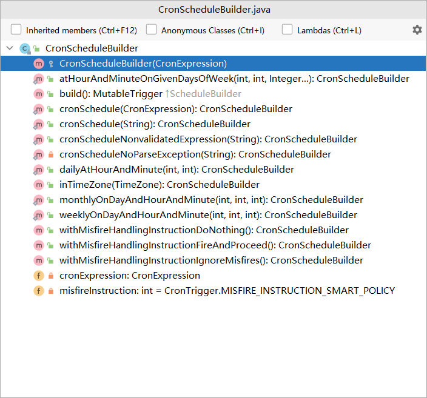
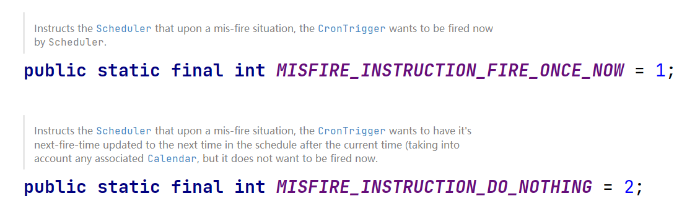
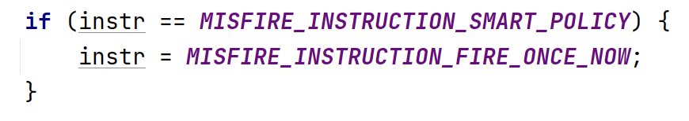
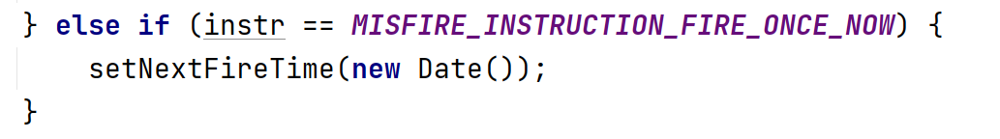
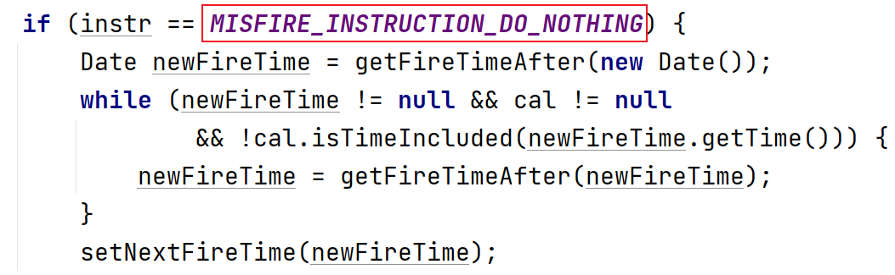
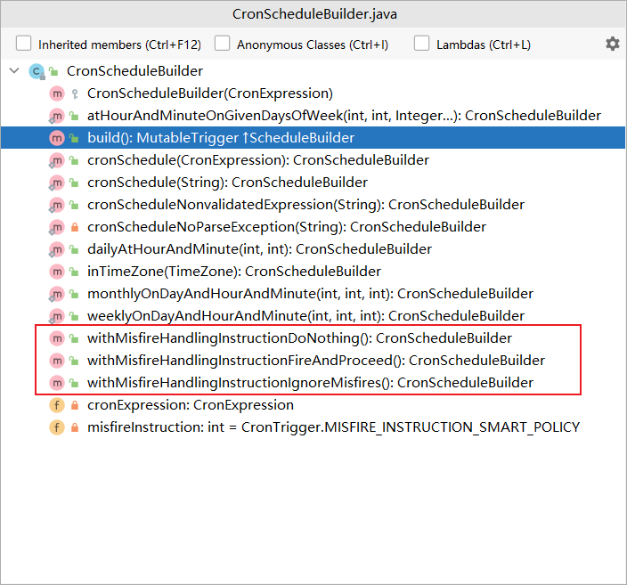

# tutorials-lesson6

`CronTrigger` 有一个 `startTime` 属性用来指定生效时间，有一个 `endTime` （可选）用来指定失效时间

Cron表达式是用来配置 `CronTrigger` 的实例的，它由七个子表达式组成，子表达式之间用空格分隔，它们分别代表：

* 秒
* 分
* 小时
* 日期
* 月
* 星期
* 年(可选)
  
下面是一个Cron表达式的例子：

`0 0 12 ? * WED` 表示的意思是：每个星期三下午12:00

下面的图片是每个子表达式所允许的取值以及Cron表达式中特殊字符的含义：





特殊字符C的作用：



当有些调度需求太过于复杂的话，可以考虑定义多个 `Trigger` ，注册它们，并执行相同的 `Job`

`CronTrigger` 使用 `TriggerBuilder` 和 `CronSchedulerBuilder` 创建

下面是一个使用 `CronTrigger` 的例子：

```java
package org.fade.demo.quartzdemo.tutorialslesson6;

import org.quartz.*;
import org.quartz.impl.StdSchedulerFactory;
import org.slf4j.Logger;
import org.slf4j.LoggerFactory;

import java.util.Date;

import static org.quartz.JobBuilder.newJob;
import static org.quartz.SimpleScheduleBuilder.simpleSchedule;

/**
 * @author fade
 * @date 2021/09/14
 */
public class Main {

    public static void main(String[] args) {
        try {
            Scheduler scheduler = scheduler = StdSchedulerFactory.getDefaultScheduler();
            scheduler.start();
            // do something
            JobDetail job = newJob(DumbJob.class)
                    .withIdentity("myJob", "group1")
                    .usingJobData("jobSays", "Hello World!")
                    .usingJobData("myFloatValue", 3.141f)
                    .build();
            // 每40秒重复执行一次
            Trigger trigger = TriggerBuilder.newTrigger()
                    .withIdentity("trigger1", "group1")
                    .startNow()
                    .withSchedule(CronScheduleBuilder.cronSchedule("0/2 * * * * ?"))
                    .build();
            scheduler.scheduleJob(job, trigger);
            try {
                Thread.sleep(60000);
            } catch (InterruptedException e) {
                e.printStackTrace();
            }
            scheduler.shutdown();
        } catch (SchedulerException e) {
            e.printStackTrace();
        }
    }

}
```

当然 `CronSchedulerBuilder` 还有一些其它方法：



`CronTrigger` 的 `misfireInstruction` 如下所示：




各个 `misfireInstruction` 的含义:（可在 `updateAfterMisfire` 方法和JavaDoc查看相应的含义）

* `MISFIRE_INSTRUCTION_SMART_POLICY`

在这种策略下，它等同于 `MISFIRE_INSTRUCTION_FIRE_ONCE_NOW` 的效果



* `MISFIRE_INSTRUCTION_IGNORE_MISFIRE_POLICY`

此种策略会使调度器不评估当时的情况，而是尽快将其触发以赶上正常的进度。例如一个每15秒触发一次的 `CronTrigger` ，如果有5分钟的错失时间，一旦有机会触发，就会快速连续触发20次。

* `MISFIRE_INSTRUCTION_FIRE_ONCE_NOW`

此种策略会使调度器马上触发 `Trigger` 一次，然后按照Cron表达式定义时间点执行



* `MISFIRE_INSTRUCTION_DO_NOTHING`

此种策略会使调度器什么也不做，而是等待Cron表达式配置的下个触发点执行任务



它们通过 `CronSchedulerBuilder` 的一些方法进行设置：

