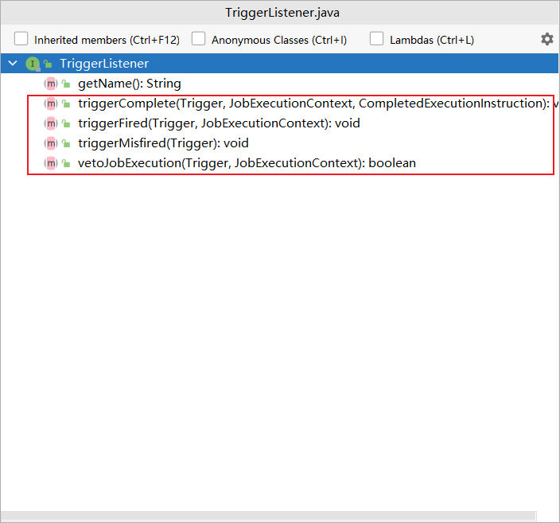
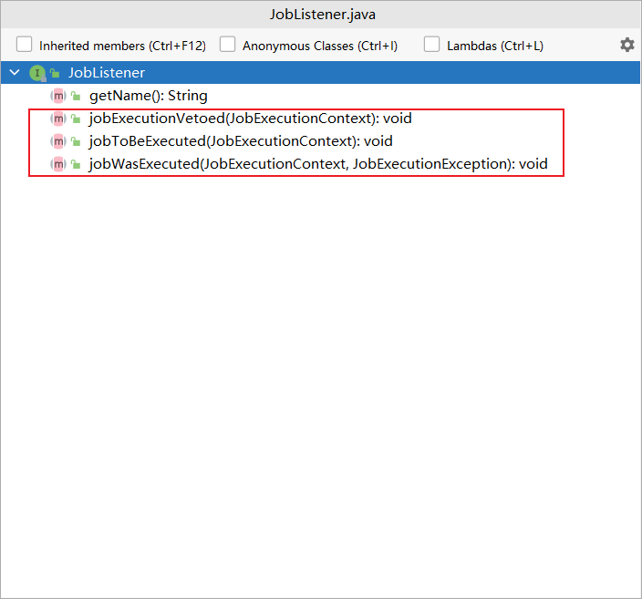
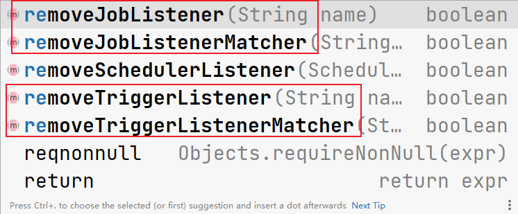

# tutorials-lesson7

`TriggerListener` 监听与触发器相关的事件， `JobListener` 监听与 `Job` 相关的事件。

与 `Trigger` 有关的事件如下所示：



与 `Job` 有关的事件如下所示：



创建自定义的监听器只需要实现上面两个接口之一即可，并注册到 `Scheduler` 中，但必须给它们定义一个名字，即给它们的 `getName()` 方法一个返回值

监听器是通过 `Scheduler` 的 `ListenerManager` 注册的

下面是一个示例：

```java
package org.fae.demo.quartzdemo.tutorialslesson7;

import org.quartz.*;
import org.quartz.impl.StdSchedulerFactory;
import org.quartz.impl.matchers.KeyMatcher;

import static org.quartz.JobBuilder.newJob;

/**
 * @author fade
 * @date 2021/09/14
 */
public class Main {

    public static void main(String[] args) {
        try {
            Scheduler scheduler = StdSchedulerFactory.getDefaultScheduler();
            scheduler.start();
            // do something
            JobDetail job = newJob(DumbJob.class)
                    .withIdentity("myJob", "group1")
                    .usingJobData("jobSays", "Hello World!")
                    .usingJobData("myFloatValue", 3.141f)
                    .build();
            // 每40秒重复执行一次
            Trigger trigger = TriggerBuilder.newTrigger()
                    .withIdentity("trigger1", "group1")
                    .startNow()
                    .withSchedule(CronScheduleBuilder.cronSchedule("0/2 * * * * ?"))
                    .build();
            MyJobListener myJobListener = new MyJobListener();
            MyTriggerListener myTriggerListener = new MyTriggerListener();
            scheduler.getListenerManager().addJobListener(myJobListener, KeyMatcher.keyEquals(new JobKey("myJob", "group1")));
//            scheduler.getListenerManager().addJobListenerMatcher("MyJobListener", KeyMatcher.keyEquals(new JobKey("myJob", "group1")));
            scheduler.getListenerManager().addTriggerListener(myTriggerListener, KeyMatcher.keyEquals(new TriggerKey("trigger1", "group1")));
            scheduler.scheduleJob(job, trigger);
            try {
                Thread.sleep(60000);
            } catch (InterruptedException e) {
                e.printStackTrace();
            }
            scheduler.shutdown();
        } catch (SchedulerException e) {
            e.printStackTrace();
        }
    }

}

package org.fae.demo.quartzdemo.tutorialslesson7;

import org.quartz.JobDetail;
import org.quartz.JobExecutionContext;
import org.quartz.JobExecutionException;
import org.quartz.JobListener;
import org.slf4j.Logger;
import org.slf4j.LoggerFactory;

/**
 * @author fade
 * @date 2021/09/14
 */
public class MyJobListener implements JobListener {

    private static final Logger logger = LoggerFactory.getLogger(MyJobListener.class);

    @Override
    public String getName() {
        return "MyJobListener";
    }

    @Override
    public void jobToBeExecuted(JobExecutionContext context) {
        logger.info("JobDetail " + context.getJobDetail().getKey() + " is about to be executed");
    }

    @Override
    public void jobExecutionVetoed(JobExecutionContext context) {
        logger.info("JobDetail "
                + context.getJobDetail().getKey()
                + " is about to be executed, but a TriggerListener vetoed it's execution.");
    }

    @Override
    public void jobWasExecuted(JobExecutionContext context, JobExecutionException jobException) {
        logger.info("JobDetail " + context.getJobDetail().getKey() + " has been executed");
    }

}

package org.fae.demo.quartzdemo.tutorialslesson7;

import org.quartz.JobDetail;
import org.quartz.JobExecutionContext;
import org.quartz.Trigger;
import org.quartz.TriggerListener;
import org.slf4j.Logger;
import org.slf4j.LoggerFactory;

/**
 * @author fade
 * @date 2021/09/14
 */
public class MyTriggerListener implements TriggerListener {

    private static final Logger logger = LoggerFactory.getLogger(MyTriggerListener.class);

    @Override
    public String getName() {
        return "MyTriggerListener";
    }

    @Override
    public void triggerFired(Trigger trigger, JobExecutionContext context) {
        logger.info("Trigger " + trigger.getKey().toString()
                + " has fired, JobDetail " + trigger.getJobKey()
                + " is about to be executed");
    }

    @Override
    public boolean vetoJobExecution(Trigger trigger, JobExecutionContext context) {
//        return true;
        return false;
    }

    @Override
    public void triggerMisfired(Trigger trigger) {
        logger.info("Trigger " + trigger.getKey().toString() + " has misfired");
    }

    @Override
    public void triggerComplete(Trigger trigger, JobExecutionContext context, Trigger.CompletedExecutionInstruction triggerInstructionCode) {
        logger.info("Trigger " + trigger.getKey().toString()
                + " has fired, JobDetail " + trigger.getJobKey()
                + " has been executed");
    }

}
```

需要注意的是 `TriggerListener` 中的 `vetoJobExecution` 如果返回 `true` ，那么 `Job` 中的 `execute()` 方法将不被执行。

既然 `TriggerListener` 和 `JobListener` 可以通过 `Scheduler` 的 `ListenerManager` 来注册，那么也可以从 `ListenerManager` 中移除，移除的方法如下：



