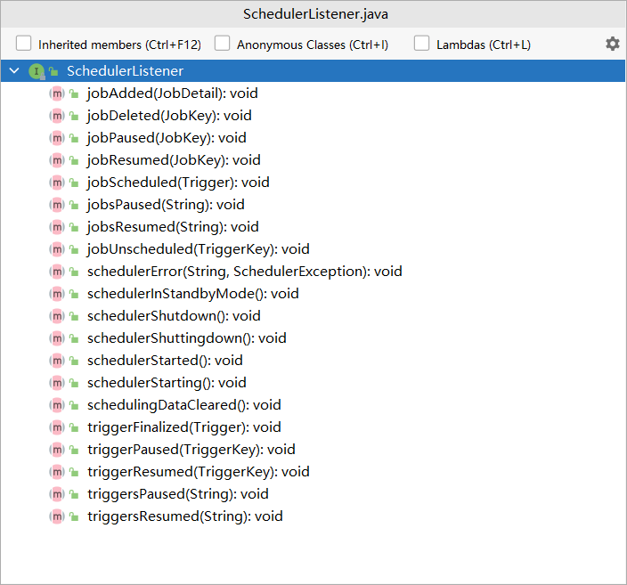

# tutorials-lesson8

`SchedulerListener` 接收 `Scheduler` 自身的事件

它的事件如下图所示：



`SchedulerListener` 也是通过 `Scheduler` 的 `ListenerManager` 进行注册，自定义的调度器监听器应该实现 `SchedulerListener` 接口

下面是一个示例：

```java
package org.fade.demo.quartzdemo.tutorialslesson8;

import org.quartz.*;
import org.slf4j.Logger;
import org.slf4j.LoggerFactory;

/**
 * @author fade
 * @date 2021/09/15
 */
public class MySchedulerListener implements SchedulerListener {

    private Scheduler scheduler;

    public MySchedulerListener(Scheduler scheduler) {
        this.scheduler = scheduler;
    }

    private static final Logger logger = LoggerFactory.getLogger(MySchedulerListener.class);

    @Override
    public void jobScheduled(Trigger trigger) {
        logger.info("JobDetail " + trigger.getJobKey() + " is scheduled");
    }

    @Override
    public void jobUnscheduled(TriggerKey triggerKey) {
        try {
            Trigger trigger = scheduler.getTrigger(triggerKey);
            logger.info("JobDetail " + trigger.getJobKey() + " is unscheduled");
        } catch (SchedulerException e) {
            e.printStackTrace();
        }
    }

    @Override
    public void triggerFinalized(Trigger trigger) {
        logger.info(trigger.getKey() + " will never be fired again");
    }

    @Override
    public void triggerPaused(TriggerKey triggerKey) {
        logger.info("Trigger " + triggerKey + " has been paused");
    }

    @Override
    public void triggersPaused(String triggerGroup) {
        if (triggerGroup != null) {
            logger.info("TriggerGroup " + triggerGroup + " has been paused");
        } else {
            logger.info("All triggerGroup has been paused");
        }
    }

    @Override
    public void triggerResumed(TriggerKey triggerKey) {
        logger.info("Trigger " + triggerKey + " has been un-paused");
    }

    @Override
    public void triggersResumed(String triggerGroup) {
        logger.info("TriggerGroup " + triggerGroup + " has been un-paused");
    }

    @Override
    public void jobAdded(JobDetail jobDetail) {
        logger.info("JobDetail " + jobDetail.getKey() + " has been added");
    }

    @Override
    public void jobDeleted(JobKey jobKey) {
        logger.info("JobDetail " + jobKey + " has been deleted");
    }

    @Override
    public void jobPaused(JobKey jobKey) {
        logger.info("JobDetail " + jobKey + " has been paused");
    }

    @Override
    public void jobsPaused(String jobGroup) {
        if (jobGroup != null) {
            logger.info("JobGroup " + jobGroup + " has been paused");
        } else {
            logger.info("All jobGroup has been paused");
        }
    }

    @Override
    public void jobResumed(JobKey jobKey) {
        logger.info("JobDetail " + jobKey + " has been un-paused");
    }

    @Override
    public void jobsResumed(String jobGroup) {
        logger.info("JobGroup " + jobGroup + " has been un-paused");
    }

    @Override
    public void schedulerError(String msg, SchedulerException cause) {
        logger.info("Error: \n" + "(msg)" + msg + "\n(cause)" + cause.getMessage());
    }

    @Override
    public void schedulerInStandbyMode() {
        try {
            logger.info("Scheduler " + scheduler.getSchedulerName() + " has move to standby mode");
        } catch (SchedulerException e) {
            e.printStackTrace();
        }
    }

    @Override
    public void schedulerStarted() {
        try {
            logger.info("Scheduler " + scheduler.getSchedulerName() + " has started");
        } catch (SchedulerException e) {
            e.printStackTrace();
        }
    }

    @Override
    public void schedulerStarting() {
        try {
            logger.info("Scheduler " + scheduler.getSchedulerName() + " is starting");
        } catch (SchedulerException e) {
            e.printStackTrace();
        }
    }

    @Override
    public void schedulerShutdown() {
        try {
            logger.info("Scheduler " + scheduler.getSchedulerName() + " has shutdown");
        } catch (SchedulerException e) {
            e.printStackTrace();
        }
    }

    @Override
    public void schedulerShuttingdown() {
        try {
            logger.info("Scheduler " + scheduler.getSchedulerName() + " has begun the shutdown sequence");
        } catch (SchedulerException e) {
            e.printStackTrace();
        }
    }

    @Override
    public void schedulingDataCleared() {
        try {
            logger.info("Scheduler " + scheduler.getSchedulerName() + " has deleted all the jobs, triggers and calendars");
        } catch (SchedulerException e) {
            e.printStackTrace();
        }
    }

}


package org.fade.demo.quartzdemo.tutorialslesson8;

import org.quartz.*;
import org.quartz.impl.StdSchedulerFactory;

import static org.quartz.JobBuilder.newJob;

/**
 * @author fade
 * @date 2021/09/15
 */
public class Main {

    public static void main(String[] args) {
        try {
            Scheduler scheduler = StdSchedulerFactory.getDefaultScheduler();
            MySchedulerListener schedulerListener = new MySchedulerListener(scheduler);
            scheduler.getListenerManager().addSchedulerListener(schedulerListener);
            scheduler.start();
            // do something
            JobDetail job = newJob(DumbJob.class)
                    .withIdentity("myJob", "group1")
                    .usingJobData("jobSays", "Hello World!")
                    .usingJobData("myFloatValue", 3.141f)
                    .build();
            // 每40秒重复执行一次
            Trigger trigger = TriggerBuilder.newTrigger()
                    .withIdentity("trigger1", "group1")
                    .startNow()
                    .withSchedule(CronScheduleBuilder.cronSchedule("0/2 * * * * ?"))
                    .build();
            scheduler.scheduleJob(job, trigger);
            try {
                Thread.sleep(60000);
            } catch (InterruptedException e) {
                e.printStackTrace();
            }
            scheduler.shutdown();
        } catch (SchedulerException e) {
            e.printStackTrace();
        }
    }

}
```

通过 `Scheduler` 的 `getListenerManager().removeSchedulerListener(***)` 方法可从 `Scheduler` 中移除监听器