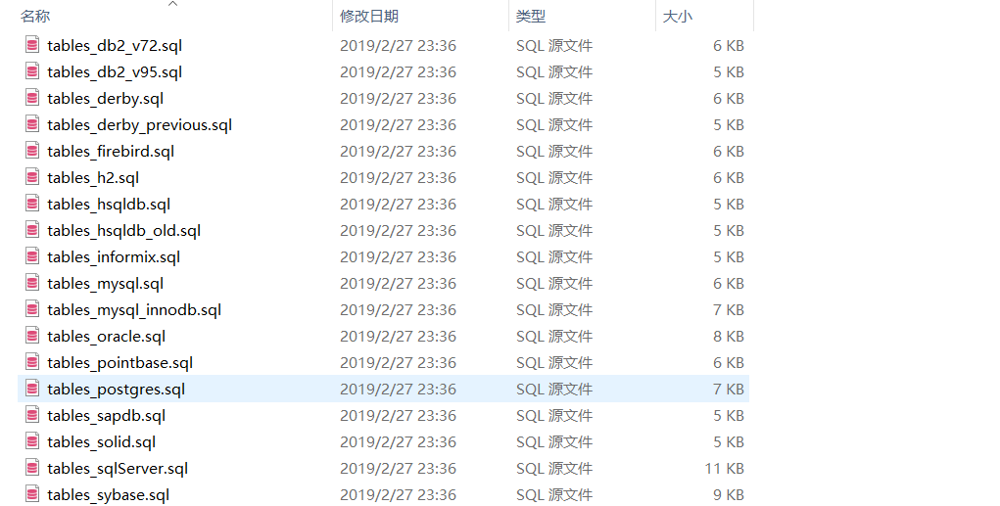

# tutorials-lesson9

`JobStore` 负责追踪提供给 `Scheduler` 的工作数据如： `Job` 、 `Trigger` 和 `Calendar` 等

你可以提供给 `SchedulerFactory` 配置（配置文件或Java对象），以决定实例化 `Scheduler` 时使用哪种 `JobStore`

但请注意不要在代码中使用 `JobStore` 实例

### RAMJobStore

`RAMJobStore` 是最简单的一种 `JobStore` ，也是在CPU时间性能上最好的，它将所有的工作数据保存在RAM中，所以它即继承了RAM的优点读写快，也继承了RAM的缺点易失性。

如果你使用的是 `StdSchedulerFactory` ，默认使用 `RAMJobStore` 。如果想要显示声明，则可以在 `classpath` 路径下新建一个 `quartz.properties` 文件，并作如下配置：

```
org.quartz.jobStore.class=org.quartz.simpl.RAMJobStore
org.quartz.threadPool.threadCount=10
```

注意上面必须指定线程数，不然程序运行会报错

### JDBCJobStore

`JDBCJobStore` 通过JDBC将数据保存在数据库中，虽然它不像 `RAMJobStore` 那样性能那么好，但是如果在数据库的主键上建立索引，性能下降也不是那么严重。

`JDBCJobStore` 已被广泛应用于Oracle, PostgreSQL, MySQL, MS SQLServer, HSQLDB和DB2。为了使用 `JDBCJobStore` ，你必须在数据库中建立一系列的表，这些建表文件你可以下载最近的release后，在下面的目录中找到：

`src/org/quartz/impl/jdbcjobstore/`



数据库的这些表都是以 `qrtz_` 为前缀，当然这个前缀你可以自定义，但是你需要在配置文件中指明。在某些情况下你可能需要在数据库中创建许多不同前缀的表。

```
org.quartz.jobStore.tablePrefix=***
```

在配置和使用 `JDBCJobStore` 之前，你还需要确定你的应用程序使用哪种事务。如果你不需要将调度命令与其它事务关联，你可以使用 `JobStoreTX` ；如果你需要quartz与其它事务一起工作，你可以使用 `JobStoreCMT` ，如此quartz会让出事务的管理权。

除此之外，使用quartz还需要配置数据源。一种方式是quartz自身来创建和管理数据源；一种方式是使用已经创建好的数据源，但需要提供数据源的JNDI名称。

如果你的 `Scheduler` 总是执行与线程池大小相同的 `Job` 数量，或许你应该将数据源的连接数设置为线程池大小+2

```
org.quartz.jobStore.dataSource=***
```

如果你正在使用的是 `StdSchedulerFactory` ，你需要在配置中指定 `JobStore` 。

接下来，你需要选择一个 `DriverDelegate` 并在配置中配置， `DriverDelegate` 负责执行特定数据库可能需要的任何JDBC工作。如果你所使用的数据库没有特定的 `DriverDelegate` ， 那么你可以使用 `StdSchedulerFactory` 。所有的 `DriverDelegate` 可在 `org.quartz.impl.jdbcjobstore` 包中找到。

```
org.quartz.jobStore.driverDelegateClass=***
```

你还可以将 `org.quartz.jobStore.useProperties` 设置为 `true` 来使 `JDBCJobStore` 将 `JobDataMap` 中的所有值都作为**字符串**（即Map的value必须是 `java.lang.String` 类型），从而避免序列化与反序列化可能导致的问题。

下面是一个配置 `JDBCJobStore` 使用quartz自定义和管理数据源的例子：

```
org.quartz.jobStore.class=org.quartz.impl.jdbcjobstore.JobStoreTX
org.quartz.threadPool.threadCount=10
org.quartz.jobStore.tablePrefix=qrtz_
## quartz自定义数据源
org.quartz.jobStore.dataSource=quartzdemo
org.quartz.dataSource.quartzdemo.driver=com.mysql.cj.jdbc.Driver
org.quartz.dataSource.quartzdemo.URL=jdbc:mysql:///task_system?useSSL=false&allowPublicKeyRetrieval=true&serverTimezone=UTC
org.quartz.dataSource.quartzdemo.user=your-own-db-username
org.quartz.dataSource.quartzdemo.password=your-own-db-password
org.quartz.dataSource.quartzdemo.maxConnections=12
org.quartz.jobStore.driverDelegateClass=org.quartz.impl.jdbcjobstore.StdJDBCDelegate
#org.quartz.jobStore.useProperties=true
```

// TODO: 更新
配置quartz使用其它数据源的例子将在以后补充

### TerracottaJobStore

`TerracottaJobStore` 在不使用数据库的情况下提供一种可伸缩，健壮的方案

`TerracottaJobStore` 可以运行在集群和非集群环境下，此时工作数据将被保存在Terracotta服务器中。这种情况下quartz的效率将比使用 `JDBCJobStore` 的方式好，但仍比使用 `RAMJobStore` 差一些。但这不失未一种很好的选择，因为它既能保证非易失性，运行效率又比数据库高一些。

如果你正在使用 `StdSchedulerFactory` ，为了使用 `TerracottaJobStore` ，你需要在配置中指出所使用的 `JobStore` 的class，还需要指出Terracotta服务器的位置：

```
org.quartz.jobStore.class=org.terracotta.quartz.TerracottaJobStore
org.quartz.jobStore.tcConfigUrl=your-terracotta-server-location
```

// TODO: 需要部署服务器
`TerracottaJobStore` 的使用示例待补充：