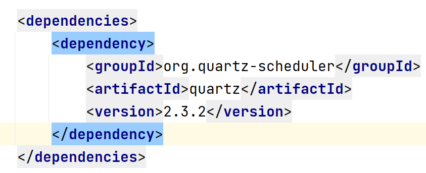

# Quartz介绍


### Quartz是什么

Quartz是一个完全由Java编写的开源作业调度框架

任务调度是什么？

任务调度可以简单的认为是 `系统为了自动完成特定任务，在约定的特定时刻去执行任务的过程`

### Github及官网地址

Github: `https://github.com/quartz-scheduler/quartz`

官网： `http://www.quartz-scheduler.org/`

### 下载安装

参考链接： `https://github.com/quartz-scheduler/quartz/blob/master/docs/downloads.adoc#using-maven-as-dependency`

maven:

```
<dependency>
  <groupId>org.quartz-scheduler</groupId>
  <artifactId>quartz</artifactId>
  <version>latest-x.y.z</version>
</dependency>
```



因为Quartz使用了sl4j，故还需要加入以下依赖：

```
<dependency>
    <groupId>ch.qos.logback</groupId>
    <artifactId>logback-classic</artifactId>
    <version>1.2.5</version>
</dependency>
```

也可以使用其它sl4j的实现包
