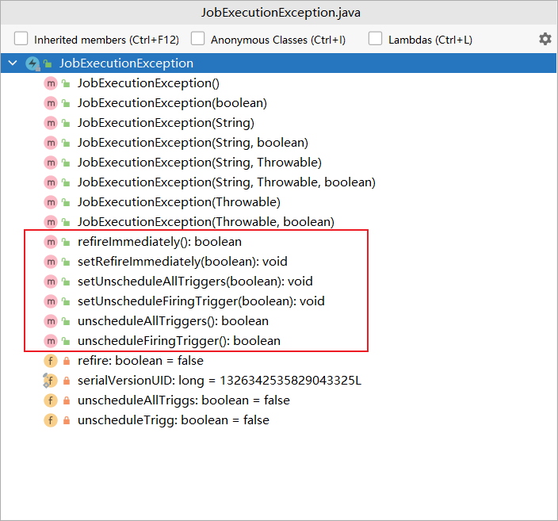

# 异常处理

### 任务执行异常

当在任务执行时捕获到了异常时，可以抛出一个 `JobExecutionException` 异常告诉quartz采取什么行动。

下面是quartz官方提供的一个示例：

```java
package org.quartz.examples.example6;

import org.quartz.DisallowConcurrentExecution;
import org.quartz.Job;
import org.quartz.JobDataMap;
import org.quartz.JobExecutionContext;
import org.quartz.JobExecutionException;
import org.quartz.JobKey;
import org.quartz.PersistJobDataAfterExecution;
import org.slf4j.Logger;
import org.slf4j.LoggerFactory;

import java.util.Date;

@PersistJobDataAfterExecution
@DisallowConcurrentExecution
public class BadJob1 implements Job {

  // Logging
  private static final Logger logger = LoggerFactory.getLogger(BadJob1.class);
  private int calculation;

  public BadJob1() {
  }

  @Override
  public void execute(JobExecutionContext context) throws JobExecutionException {
    JobKey jobKey = context.getJobDetail().getKey();
    JobDataMap dataMap = context.getJobDetail().getJobDataMap();

    int denominator = dataMap.getInt("denominator");
    logger.info("---" + jobKey + " executing at " + new Date() + " with denominator " + denominator);

    // a contrived example of an exception that
    // will be generated by this job due to a
    // divide by zero error (only on first run)
    try {
      calculation = 4815 / denominator;
    } catch (Exception e) {
      logger.info("--- Error in job!");
      JobExecutionException e2 = new JobExecutionException(e);

      // fix denominator so the next time this job run
      // it won't fail again
      dataMap.put("denominator", "1");

      // this job will refire immediately
      e2.setRefireImmediately(true);
      throw e2;
    }

    logger.info("---" + jobKey + " completed at " + new Date());
  }

}
 
package org.quartz.examples.example6;

import java.util.Date;

import org.quartz.DisallowConcurrentExecution;
import org.quartz.Job;
import org.quartz.JobExecutionContext;
import org.quartz.JobExecutionException;
import org.quartz.JobKey;
import org.quartz.PersistJobDataAfterExecution;
import org.slf4j.Logger;
import org.slf4j.LoggerFactory;

@PersistJobDataAfterExecution
@DisallowConcurrentExecution
public class BadJob2 implements Job {

    // Logging
    private static final Logger logger = LoggerFactory.getLogger(BadJob2.class);
    private int calculation;

    public BadJob2() {
    }

    @Override
    public void execute(JobExecutionContext context)
        throws JobExecutionException {
        JobKey jobKey = context.getJobDetail().getKey();
        logger.info("---" + jobKey + " executing at " + new Date());

        // a contrived example of an exception that
        // will be generated by this job due to a 
        // divide by zero error
        try {
            int zero = 0;
            calculation = 4815 / zero;
        } catch (Exception e) {
            logger.info("--- Error in job!");
            JobExecutionException e2 = 
                new JobExecutionException(e);
            // Quartz will automatically unschedule
            // all triggers associated with this job
            // so that it does not run again
            e2.setUnscheduleAllTriggers(true);
            throw e2;
        }

        logger.info("---" + jobKey + " completed at " + new Date());
    }

}

package org.quartz.examples.example6;

import static org.quartz.DateBuilder.nextGivenSecondDate;
import static org.quartz.JobBuilder.newJob;
import static org.quartz.SimpleScheduleBuilder.simpleSchedule;
import static org.quartz.TriggerBuilder.newTrigger;

import org.quartz.JobDetail;
import org.quartz.Scheduler;
import org.quartz.SchedulerFactory;
import org.quartz.SchedulerMetaData;
import org.quartz.SimpleTrigger;
import org.quartz.impl.StdSchedulerFactory;
import org.slf4j.Logger;
import org.slf4j.LoggerFactory;

import java.util.Date;

public class JobExceptionExample {

  public void run() throws Exception {
    Logger log = LoggerFactory.getLogger(JobExceptionExample.class);

    log.info("------- Initializing ----------------------");

    // First we must get a reference to a scheduler
    SchedulerFactory sf = new StdSchedulerFactory();
    Scheduler sched = sf.getScheduler();

    log.info("------- Initialization Complete ------------");

    log.info("------- Scheduling Jobs -------------------");

    // jobs can be scheduled before start() has been called

    // get a "nice round" time a few seconds in the future...
    Date startTime = nextGivenSecondDate(null, 15);

    // badJob1 will run every 10 seconds
    // this job will throw an exception and refire
    // immediately
    JobDetail job = newJob(BadJob1.class).withIdentity("badJob1", "group1").usingJobData("denominator", "0").build();

    SimpleTrigger trigger = newTrigger().withIdentity("trigger1", "group1").startAt(startTime)
        .withSchedule(simpleSchedule().withIntervalInSeconds(10).repeatForever()).build();

    Date ft = sched.scheduleJob(job, trigger);
    log.info(job.getKey() + " will run at: " + ft + " and repeat: " + trigger.getRepeatCount() + " times, every "
             + trigger.getRepeatInterval() / 1000 + " seconds");

    // badJob2 will run every five seconds
    // this job will throw an exception and never
    // refire
    job = newJob(BadJob2.class).withIdentity("badJob2", "group1").build();

    trigger = newTrigger().withIdentity("trigger2", "group1").startAt(startTime)
        .withSchedule(simpleSchedule().withIntervalInSeconds(5).repeatForever()).build();

    ft = sched.scheduleJob(job, trigger);
    log.info(job.getKey() + " will run at: " + ft + " and repeat: " + trigger.getRepeatCount() + " times, every "
             + trigger.getRepeatInterval() / 1000 + " seconds");

    log.info("------- Starting Scheduler ----------------");

    // jobs don't start firing until start() has been called...
    sched.start();

    log.info("------- Started Scheduler -----------------");

    try {
      // sleep for 30 seconds
      Thread.sleep(30L * 1000L);
    } catch (Exception e) {
      //
    }

    log.info("------- Shutting Down ---------------------");

    sched.shutdown(false);

    log.info("------- Shutdown Complete -----------------");

    SchedulerMetaData metaData = sched.getMetaData();
    log.info("Executed " + metaData.getNumberOfJobsExecuted() + " jobs.");
  }

  public static void main(String[] args) throws Exception {

    JobExceptionExample example = new JobExceptionExample();
    example.run();
  }

}
```

上面的示例中 `BadJob1` 的 `execute()` 方法内在捕获到异常时，通过抛出一个 `JobExecutionException` 异常，并调用 `JobExecutionException` 实例的 `setRefireImmediately(true)` 方法来告诉quartz，发生了异常，但马上重新触发执行。 `BadJob2` 则调用`JobExecutionException` 实例的 `setUnscheduleAllTriggers(true)` 方法来停止调度。

`JobExecutionException` 还有一些类似的这种可以通知quartz该怎么做的方法：

