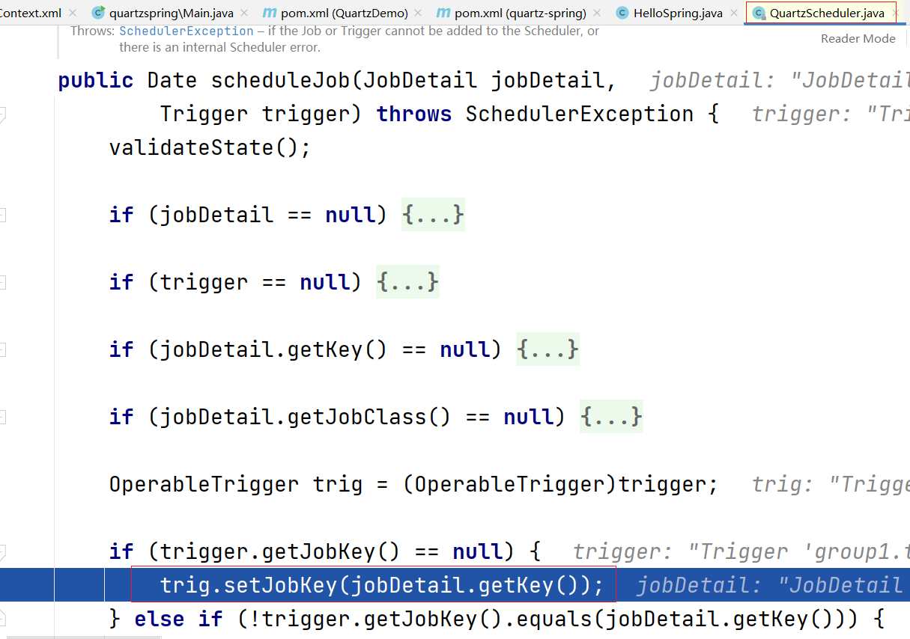
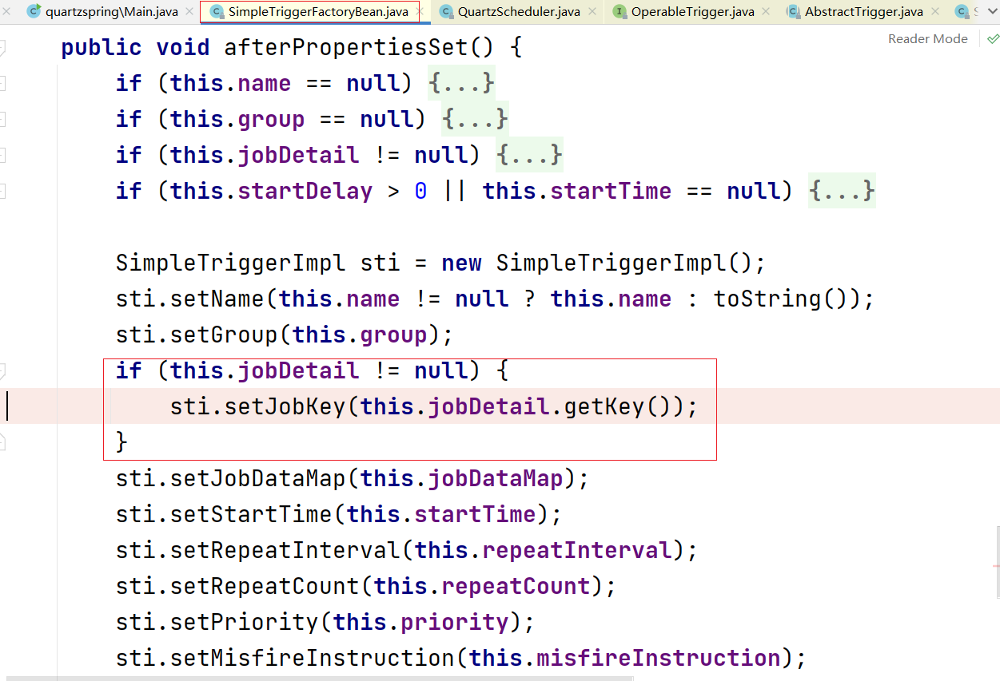
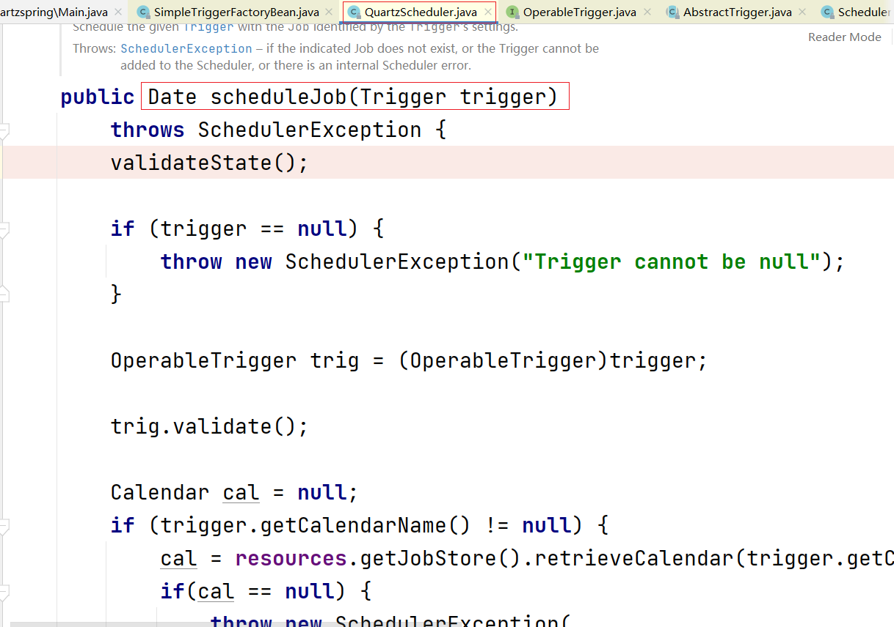

# 集成Spring

本文主要介绍Quartz集成Spring的简单应用。

### 依赖

Quartz集成Spring最少需要以下依赖（maven）：

```xml
<dependency>
  <groupId>org.quartz-scheduler</groupId>
  <artifactId>quartz</artifactId>
  <version>${quartz-version}</version>
</dependency>

<dependency>
  <groupId>ch.qos.logback</groupId>
  <artifactId>logback-classic</artifactId>
  <version>${logback-classic-version}</version>
</dependency>

<dependency>
  <groupId>org.springframework</groupId>
  <artifactId>spring-context-support</artifactId>
  <version>${spring.framework.version}</version>
</dependency>

<dependency>
  <groupId>org.springframework</groupId>
  <artifactId>spring-tx</artifactId>
  <version>${spring.framework.version}</version>
</dependency>
```

### 示例

简单的一个任务，打印 `Hello Spring, I am Quartz!` 两次，中间间隔5秒

* Job

```java
package org.fade.demo.quartzdemo.quartzspring;

import org.quartz.Job;
import org.quartz.JobExecutionContext;
import org.quartz.JobExecutionException;
import org.slf4j.Logger;
import org.slf4j.LoggerFactory;

/**
 * @author fade
 * @date 2021/11/24
 */
public class HelloSpring implements Job {

    private static final Logger LOG = LoggerFactory.getLogger(HelloSpring.class);

    @Override
    public void execute(JobExecutionContext context) throws JobExecutionException {
        LOG.info("Hello Spring, I am Quartz!");
    }

    public void execute() {
        LOG.info("Hello Spring, I am Quartz!");
    }

}
```

* Spring上下文文件

```xml
<?xml version="1.0" encoding="UTF-8"?>
<beans xmlns="http://www.springframework.org/schema/beans"
       xmlns:xsi="http://www.w3.org/2001/XMLSchema-instance"
       xsi:schemaLocation="http://www.springframework.org/schema/beans http://www.springframework.org/schema/beans/spring-beans.xsd">

    <bean id="helloSpring" class="org.fade.demo.quartzdemo.quartzspring.HelloSpring" />

    <!--JobDetail有两种创建方式-->
    <!--通过MethodInvokingJobDetailFactoryBean的方式-->
    <!--此方式无须实现Job接口-->
<!--    <bean id="jobDetail" class="org.springframework.scheduling.quartz.MethodInvokingJobDetailFactoryBean">-->
<!--        <property name="targetObject" ref="helloSpring" />-->
<!--        <property name="targetMethod" value="execute" />-->
<!--    </bean>-->
    <!--通过JobDetailFactoryBean的方式-->
    <bean id="jobDetail" class="org.springframework.scheduling.quartz.JobDetailFactoryBean">
        <property name="jobClass" value="org.fade.demo.quartzdemo.quartzspring.HelloSpring" />
        <property name="durability" value="true" />
    </bean>

    <!--集成Spring时，调度方式和非Spring方式有所不同，
    JobKey是由Trigger中关联的JobDetail决定的，
    需同时在Scheduler中指定JobDetail-->
    <!--Trigger也可以配置多种，比如SimpleTrigger和CronTrigger-->
    <!--这里只演示SimpleTrigger-->
    <bean id="simpleTrigger" class="org.springframework.scheduling.quartz.SimpleTriggerFactoryBean">
        <property name="startTime" value="#{new java.util.Date()}" />
        <property name="repeatCount" value="1" />
        <property name="repeatInterval" value="5000" />
        <property name="jobDetail" ref="jobDetail" />
    </bean>

    <bean id="scheduler" class="org.springframework.scheduling.quartz.SchedulerFactoryBean">
        <property name="jobDetails" ref="jobDetail" />
        <property name="triggers" ref="simpleTrigger" />
    </bean>

</beans>
```

* 启动类

```java
package org.fade.demo.quartzdemo.quartzspring;

import org.quartz.Scheduler;
import org.quartz.SchedulerException;
import org.springframework.context.ApplicationContext;
import org.springframework.context.support.ClassPathXmlApplicationContext;

/**
 * @author fade
 * @date 2021/11/24
 */
public class Main {

    public static void main(String[] args) {
        ApplicationContext context = new ClassPathXmlApplicationContext("applicationContext.xml");
        Scheduler scheduler = context.getBean("scheduler", Scheduler.class);
        try {
            scheduler.start();
            Thread.sleep(5000);
            scheduler.shutdown();
        } catch (SchedulerException | InterruptedException e) {
            e.printStackTrace();
        }
    }

}
```

这里需要注意的是，集成Spring时和使用非Spring方式时任务的调度方式有所不同，JobKey的设置的时机也不同。



使用非Spring方式时，JobKey是直接在 `QuartzScheduler` 里的 `scheduleJob(JobDetail jobDetail, Trigger trigger)` 方法里设置的。





而集成Spring时，是在由Spring提供的 `SimpleTriggerFactoryBean` 的 `afterPropertiesSet()` 方法里设置的，然后这个任务才被 `QuartzScheduler` 的 `scheduleJob(Trigger trigger)` 方法调度。

所以，在集成Spring时，你需要给 `Trigger` 关联 `JobDetail`

